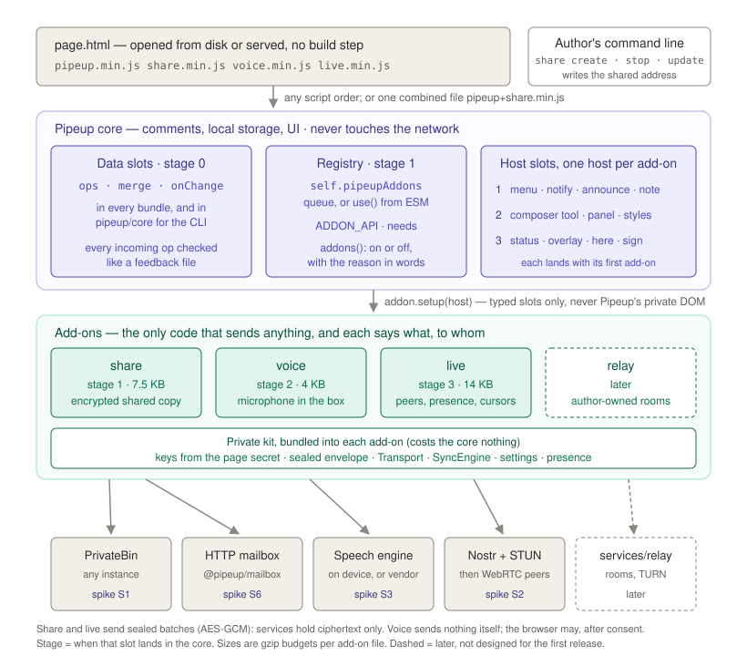

# Add-ons

Status: **approved** (2026-10-07). All 20 decisions accepted as recommended; decision 1 (size) is
recorded in §15. Functional requirements: [FUNCTIONAL_SPEC.md](../FUNCTIONAL_SPEC.md) §1, §4, §10–§19
and §11a. **What gates code:** the spikes in §18's "Now" step, each for its own stage.



Code paths are relative to `libs/ts/pipeup/`; doc paths to the repository root.

## Goal

One core plus optional add-ons, not forked builds. An author who wants shared comments, live review
or dictation adds one script, or uses one combined file. A page without add-ons pays only for the
small add-on support built into the core.

Add-ons must:

- work from a page opened from disk, in any script order, with no build step;
- leave the core network-free: only an add-on sends anything, and each says what it sends, to whom,
  and what they can see;
- never bypass the core's checks: every op from elsewhere is verified exactly as a feedback file is;
- code against typed, versioned contracts, never Pipeup's private DOM, class names or mangled names;
- share one data contract, so a free service, peer to peer and the planned relay can run side by side
  and converge;
- also run headless against `pipeup/core` (CLI, agents) where they carry data;
- pay for every core byte, measured, with a stated order for what is cut first;
- carry no third-party code, bundled or loaded at run time, just as the core doesn't (R11). Only
  browser APIs and code in this repository; build and test tools are dev dependencies only.

The approach is **typed capability slots**: an add-on is a plain object; the core calls its `setup`
with a host whose members are the slots. Slots land in stages, each with the first add-on that needs
it.

## What we got wrong before

1. **There is no localStorage fallback.** If IndexedDB fails or takes more than 4 s, Pipeup keeps
   comments in memory and shows a toast (`src/ui/mount.ts:52-74`, `105-108`). On such browsers a
   sharing add-on is the only copy that lasts. Architecture §7's "localStorage, IndexedDB: work" is a
   platform finding, not a fallback; it is reworded in this change (§19).
2. **Op v1 has no per-author sequence numbers.** Architecture §4 ("sends its highest known sequence
   number per author") and §6 ("per-author sequence numbers reveal gaps") assume them. v1 reconciles
   by op-id sets; sequence numbers need op v2.
3. **Workers loaded from `https` don't work on `file://`.** `new Worker("https://…")` throws in Chrome
   and fails in Firefox; module Blob workers fail in Chrome. Only classic Blob workers work.
4. **On `file://`, every local HTML file shares one storage area** (tested in Chrome 154 and Firefox
   153), IndexedDB and the Cache API alike. Anything Pipeup or an add-on stores can be read, replaced,
   and the identity key used, by any other local page.
5. **"The relay verifies signatures on write"** needs a key the relay holds. A plain storage service
   verifies nothing; clients verify on read, as they already do.
6. **This reopens the 2B "one file" decision, on purpose.** The core stays one file; add-ons are
   separate files, and combined files keep the one-file option (architecture §11).
7. **Sharing is not only a transport question.** Once comments can reach a third-party service,
   *whose* comments a browser sends, and when the reviewer agreed, matter as much as encryption. §7.3
   makes every reviewer the only sender of their own comments.

## The model

```
 page.html
   <script src=pipeup.min.js>     core: comments, local storage, UI, the add-on host
   <script src=share.min.js>      add-on: kit + PrivateBin transport + its menu rows
   <script src=voice.min.js>      add-on: kit (small part) + speech engine + composer tool
        │  (self.pipeupAddons ||= []).push(addon)
        ▼
 Pipeup ── each mount ──► addon.setup(host)
   host.document   id · me · threads · ops · onChange(added, source)     (read only)
   host.merge      the only way in for other people's ops                ◄── also headless (pipeup/core)
   host.addMenuItem · notify · announce · setComposerNote · addComposerTool · openPanel · setStatus · overlay …
```

| Layer | Where | Versioned by | Size counts against |
|---|---|---|---|
| Data slots | `PipeupDocument` (`src/document.ts`) | `ADDON_API` (breaking) | core and core-only budgets |
| UI slots, registry, remote-change handling | new `src/ui/addons.ts`, exported from `src/index.ts` | `ADDON_API` plus capability names (additive) | core budget |
| Kit | `libs/ts/addons/kit`, bundled into each add-on | lockstep | each add-on's budget |
| Add-ons | `@pipeup/share`, `@pipeup/voice`, `@pipeup/live`, later `@pipeup/relay` | lockstep while 0.x | their own budgets |

### How a byte gets into the core

A slot goes into the core only if all four hold:

1. it can't be done from outside without reaching into private code or into DOM that Pipeup rebuilds
   (`viewsFor()` recreates the launcher, column and bubbles on every layout change, `src/ui/app.ts:47-53`);
2. an add-on in the next milestone needs it in its first release, and that add-on's spike passed (§18);
3. its cost is measured with `scripts/size.mjs` before merge, and paid for (§15);
4. every name crossing between core and add-on survives `mangleProps` (§4), checked by a test.

What is left out, and why, is in §15.

## 1. Data slots (on `PipeupDocument`, in every bundle)

```ts
// src/core.ts
export type { SignedOp, OpBody } from "./model/types";   // types only

// src/document.ts
export type Listener = (
  threads: readonly Thread[],
  added: readonly SignedOp[],   // [] for a rename
  source: string,               // "local" | "file" | an add-on id | "" (rename)
) => void;

export class PipeupDocument {
  /** Every verified op this browser holds, as {body, sig}. A new array each call; don't mutate the ops. */
  ops(): readonly SignedOp[];

  /**
   * Verifies and merges ops from elsewhere; resolves to how many were new. Same checks, queue,
   * persistence and UnsavedChangeError as importFile, which becomes merge(await readFeedbackFile(…), "file").
   * Listeners hear once per call, only if something was added. More than 5,000 ops throws RangeError.
   */
  merge(ops: readonly unknown[], source: string): Promise<number>;

  /** Existing; listeners now also get (added, source). A (threads) => void listener still works. */
  onChange(fn: Listener): () => void;

  /** Stage 3. Signs "pipeup:" + purpose + "\n" + data with this reviewer's identity key; base64url. */
  sign(purpose: string, data: string): Promise<string>;
}
```

`write()` notifies with `([op], "local")`; setting the name with `([], "")`. The sources `local`,
`file` and `""` are reserved.

**Add-ons get a read-only view, not the document.** `host.document` is an `AddonDocument`:

```ts
export interface AddonDocument {
  readonly id: string;
  readonly me: string;            // this reviewer's public key: share sends only ops with author === me
  threads(): readonly Thread[];
  ops(): readonly SignedOp[];
  onChange(fn: Listener): Off;
}
```

There is no `comment`, `reply`, `edit`, `remove`, `resolve`, `name =`, `importFile` or `sign` on it;
ops from elsewhere go in through `host.merge`, signatures through `host.sign`. That makes "add-ons
never post on your behalf" structural for add-ons that keep the rules (§12). It does not stop a
hostile script: any script can call `Pipeup.mount()` and get the full instance. About 60 B (§15).

**Hardening that lands with the data slots,** before any op reaches another person's machine:

- **Store what was signed, nothing else.** `OpLog.add` keeps `{ body, sig }`, not the incoming object
  (`src/model/log.ts:47`). Today a 100 KB unsigned `junk` field survives storage and export.
- **Bound each op.** `isWellFormed` refuses an op whose canonical JSON of `{body, sig}` is over 2^18
  characters. A unit test builds the largest legal op (10,000-unit text and a maximal quote, every
  character escaped, a full view) and asserts it is under the bound, so a real comment is never dropped.
- **Cap each merge** at 5,000 ops, as `MAX_CHARS` caps a file (`src/storage/feedback-file.ts:14`).
- **No strict schema yet.** Unknown signed fields are harmless once bounded (the fold ignores them),
  and the `v === 1` gate (`src/model/ops.ts:67`) sends new fields to v2. Architecture §4's "make the
  v1 schema strict before the relay ships" becomes "bound and normalise v1 before any sync ships".

**Migration of stored ops.** Comments already in reviewers' IndexedDB from 0.3 and 0.4 betas load
through the same path:

- Loading **normalises in memory**: unsigned fields are stripped *before* the bound is applied, so
  every op that was valid under the old rules is still valid (the bound covers only signed content,
  and the worst-case test shows no legal signed content reaches it).
- **Stored records are not rewritten.** New writes store `{body, sig}`; old records keep their extra
  fields on disk until the document is next persisted, and are never exported with them.
- **Nothing stored is ever deleted by loading.** A record that still fails (corrupt, or a future `v`)
  stays in the store, is left out of the fold, and is counted in words: one console warning ("1 saved
  change on this page couldn't be read; it is kept") and a line in `pipeup check`.
- A fixture test loads an IndexedDB dump from 0.4.0-beta.2, including an op with an extra unsigned
  field, and asserts the same threads, an export without the extra field, and an unchanged stored
  record. CHANGELOG and spec §16 record the promise: comments written by any released version stay
  readable.

**What add-ons rely on**

- **Snapshot, then subscribe, without a gap.** `ops()` and `onChange` registration are synchronous and
  the log only changes inside queued tasks.
- **Order doesn't matter.** The fold is deterministic over the op set (`src/model/fold.ts`); duplicates
  collapse by content-addressed id.
- **Merged ops are saved locally** by the same path as local writes, so the page has them offline later.
- **Sync is never an `OpStore`.** That contract says stores never leave the machine
  (`src/storage/store.ts:9`), the store is loaded once, and it holds the identity's private key.
- **Domain-separated signatures.** `sign` refuses a purpose not matching
  `/^[a-z][a-z0-9-]{1,23}\/[a-z][a-z0-9-]{0,31}$/` (`<add-on id>/<name>`). The signed string starts
  `pipeup:`, never `{`, so it can never verify as an op body. There is no API that signs raw bytes.
  Verification needs only the public key, so it lives in the kit.
- **What each add-on forwards is its own policy** (§6.3): share sends only this reviewer's own
  comments (§7.3); live forwards any verified op to peers who hold the page (§9.3).

## 2. Registering add-ons (UI bundles only)

```ts
// src/ui/addons.ts, exported from src/index.ts (IIFE global and ESM), never from src/core.ts
export const ADDON_API = 1;
export function use(addon: PipeupAddon): void;
export function addons(): readonly AddonInfo[];

export interface AddonInfo {
  id: string;
  version: string;
  network: NetworkUse;
  state: "waiting" | "on" | "off" | "failed";   // waiting = registered, Pipeup not mounted yet
  reason?: string;                               // why it is off or failed, in words
}

export interface PipeupAddon {
  /** /^[a-z][a-z0-9-]{1,23}$/; also the source of everything it merges. */
  readonly id: string;
  /** The add-on API it was written for; must equal ADDON_API while 0.x. */
  readonly api: number;
  readonly version: string;
  /** Slots it can't work without. A missing one keeps it off, with a reason. */
  readonly needs: readonly Capability[];
  /** What it sends where. For people, docs and `pipeup check`; not enforced at run time (§12). */
  readonly network: NetworkUse;
  /** Once per mount. May return a teardown for what the add-on itself opened. */
  setup(host: AddonHost): void | Teardown | Promise<void | Teardown>;
}

export type Teardown = () => void;
export type Off = () => void;

export interface NetworkUse {
  when: "never" | "after-consent" | "page-configured";
  to: readonly string[];    // hosts; "page" = an address the page names
  says: string;             // one plain sentence: what leaves the device, who sees what
}

export type Capability =
  | "sync" | "menu" | "notify" | "note"          // stage 1
  | "composer" | "panel" | "styles"              // stage 2
  | "status" | "overlay" | "here" | "sign";      // stage 3
```

**Classic add-ons register through a queue:**

```js
(self.pipeupAddons ||= []).push(addon);
```

- **The classic core** drains `self.pipeupAddons` when its script runs and again at every `mount()`,
  then replaces it with `{ push: use }`. So every order works: add-on before or after the core,
  `async`, `defer`, injected late, `data-pipeup-auto="off"`. "Core first" becomes advice, not a rule.
- **The ESM core** (`src/index.ts`) has no load-time side effects. Its `mount()` drains
  `self.pipeupAddons` the same way and installs `{ push: use }`, so a classic add-on from a CDN on a
  page built with the ESM core is picked up.
- **The drain accepts an array or an object with `push`.** An array is drained; an object with `push`
  that isn't this core's own means another core owns the queue (below).
- **ESM users** may also call `use(share())` before or after `mount()`. Add-on ESM builds import only
  *types* from `pipeup`, never run-time code, so a bundle never holds a second core with its own module
  state.

**One core per page.** An author or agent can include both `pipeup.min.js` and `pipeup+share.min.js`,
or an app bundle can carry the ESM core while the page also loads the classic one.

- The classic build is wrapped so that, when `self.Pipeup` already has a `VERSION`, the second copy
  defines nothing, doesn't auto-mount, and logs one warning in words: "Pipeup is on this page twice
  (0.7.0 and 0.7.0); the first one is used. Remove one script." Add-ons in a combined file still
  register: their `push` reaches the first core's queue, and a duplicate id is ignored.
- The ESM core's `mount()`, finding a queue owned by another core, rejects with the same sentence and
  mounts nothing.
- `pipeup check` reports two cores as a failure. Both cases are in the load-order e2e matrix (§11).

**`use` rules**

- Reserved ids: `local`, `file`, `page`, `user`, `pipeup`, `presence`, `sync`.
- A second add-on with an id already registered is ignored with a `console.warn`. A page that loads
  both a combined file and the separate add-on gets it once.
- `api !== ADDON_API` → state `off`, reason "needs add-on API 2; this Pipeup has 1".
- A missing capability in `needs` → state `off`, reason "this Pipeup has no composer slot". Optional
  slots are checked at run time with `host.has()`.
- `Pipeup.addons()` lets `pipeup check`, agents and e2e tests see which add-ons are on, and why not.

## 3. The host (one per add-on per mount)

```ts
export interface AddonHost {
  readonly api: number;
  readonly version: string;              // core VERSION, for diagnostics only
  readonly document: AddonDocument;      // read only (§1)
  readonly root: Element;                // the area people comment on
  readonly ephemeral: boolean;           // this browser can't keep comments (the in-memory store)
  readonly signal: AbortSignal;          // aborted at teardown: pass it to fetch, timers, sockets
  has(c: Capability): boolean;
  /** document.merge(ops, this add-on's id): the source can't be set wrongly. */
  merge(ops: readonly unknown[]): Promise<number>;

  // stage 1
  addMenuItem(item: MenuItem): ItemHandle;
  notify(text: string): void;
  announce(text: string): void;
  setComposerNote(text: string | null): void;

  // stage 2
  addComposerTool(tool: ComposerTool): Off;
  openPanel(content: Node, options: PanelOptions): PanelHandle;
  addStyles(css: string): Off;

  // stage 3
  setStatus(status: Status | null): void;
  overlay(): HTMLElement;
  onFrame(fn: () => void): Off;
  where(at?: Node): ViewState | undefined;   // what a comment on `at` would save (Here.view)
  isHere(view?: ViewState): boolean;         // the rule threads follow (Here.holds)
  go(view: ViewState): Promise<boolean>;     // Here.navigate; true once there
  onUi(fn: (ui: UiSnapshot) => void): Off;   // called at once, then on change
  avatar(key: string, name: string): HTMLElement;
  sign(name: string, data: string): Promise<string>;   // document.sign(id + "/" + name, data)
}
```

**Everything an add-on adds through the host belongs to that add-on and that mount.** On unmount the
host removes its rows, notes, tools, panels, styles, overlay and frame callbacks, and aborts `signal`.
The teardown only releases what the add-on itself opened (a microphone, a peer connection). After
teardown the host's methods do nothing.

### 3.1 Menu item (stage 1)

```ts
export interface MenuItem {
  id: string;
  icon: readonly string[];   // 24-unit SVG path data, drawn by Pipeup's draw(); never markup
  label(): string;           // short: the menu is 290 px wide and truncates
  hint(): string;            // tooltip and aria-description
  checked?(): boolean;       // present → a switch row (menuitemcheckbox) that keeps the menu open
  count?(): string;          // short end text, e.g. "3"
  select(): void | Promise<void>;
}
export interface ItemHandle { update(): void; remove(): void }
```

- Add-on rows sit in their own group between "All comments" and the separator above "Start
  commenting", grouped by add-on in registration order. "Start commenting" stays nearest the button
  and stays the row focused when the menu opens from the keyboard (`src/ui/launcher.ts:476`).
- Rows are held by the app, not the launcher, so they survive a layout-mode rebuild
  (`src/ui/app.ts:579-583`). `build()` uses a version check instead of `menu.firstChild !== idRow`
  (`src/ui/launcher.ts:431-434`); `sync()` reads the getters.
- `update()` re-reads the getters only while the menu is open; it never triggers a full render.
- If `select` throws or rejects, its message is shown in the toast, so
  `throw new Error("Can't reach paste.example.org")` reaches the reviewer in words. The menu is open
  at that moment, so this is never a notice while comments are closed (§3.2).

### 3.2 Notices, announcements and the composer note (stage 1)

**"Comments are closed"** means Pipeup shows only its control: no menu, panel, column, thread or
comment mode. Spec §1 promises the page looks unchanged then; §11a extends that to add-ons.

- **`notify(text)`** uses the single toast.
  - While comments are open, it shows at once. It never replaces the "This browser can't keep
    comments" toast while that is showing.
  - **While comments are closed, it is deferred.** The latest notice per add-on is kept and shown once,
    as the toast, the next time the reviewer opens the menu or comments. Meanwhile only the control's
    label and tooltip may change (status, stage 3).
  - Add-ons never notify during `setup`.
  - The core's own "can't keep comments" toast at mount is unchanged; it is the one notice that may
    show while closed, because it concerns words the reviewer may be about to lose.
- **`announce(text)`** puts plain words in Pipeup's polite announcement region (below). Use it for
  changes a screen-reader user can't otherwise notice: "Listening", "Stopped listening", "Red Fox
  joined". It follows the announcement rules in §3.6.
- **`setComposerNote(text)`** sets one quiet line Pipeup shows above the new-comment box while it is
  open (one note per add-on; the latest set wins if two exist). Share uses it to tell a reviewer,
  before their first comment, that comments are shared. `null` removes it.

### 3.3 Composer tool (stage 2)

The composer row is `[before][textarea][send]` (`src/ui/composer.ts:27`). With this slot, Pipeup
draws a 26 px tool button between the textarea and Send, in the new-comment box and every reply line.
Tools registered late are added in place, never by rebuilding the views, so half-written words survive.

```ts
export interface ComposerTool {
  id: string;
  icon: readonly string[];
  label: string;                  // tooltip and aria-label
  available?(): boolean;          // false → no button at all
  press(handle: ComposerHandle): void;
}
export interface ComposerHandle {
  readonly kind: "comment" | "reply";
  readonly thread: string | null;
  text(): string;
  focus(): void;
  connected(): boolean;           // the box is still on screen
  setPressed(on: boolean): void;  // aria-pressed and the button's look
  dictate(): Dictation;           // one live insertion at the caret
  onEnd(fn: () => void): Off;     // send, cancel, clear, or the box removed
}
export interface Dictation {
  update(text: string): void;     // replace the words in progress
  commit(text: string): void;     // make them final; the next update starts after them
  cancel(): void;                 // remove the words in progress
}
```

- Words in progress live in the real textarea from the first `update`, so every "words are never
  lost" rule covers them (`draftEmpty`, `held`, unsent replies; `src/ui/app.ts:266, 395-401, 441-447`).
- `dictate()` writes with `setRangeText` and then runs the composer's own `sync()`, so height and Send
  stay right.
- Pressing a tool button takes no focus and doesn't move the caret: the row's `mousedown` handler
  (`src/ui/composer.ts:49-54`) exempts tool buttons. Because the button never takes focus, a change of
  its pressed state isn't announced by itself; tools announce it with `host.announce`.
- Past two tools, the rest go to an overflow (designed when a second tool exists).

### 3.4 Panel and styles (stage 2)

```ts
export interface PanelOptions { label: string; onClose?(): void }
export interface PanelHandle { close(): void }
```

- `openPanel` offers add-ons the side popover the launcher already has (`src/ui/launcher.ts:288-317`).
  Pipeup places it (in the 0.5 drawer on narrow pages), makes the rest of its UI `inert`, moves focus
  in and back, and lets Escape close it before anything else.
- The add-on supplies a node built with `textContent`, styled with its own classes and the public
  tokens. Panels hold consent notices, the people here, and later invite codes.
- `addStyles(css)` appends a constructed sheet to the shadow root (a `<style>` where unsupported,
  mirroring `src/ui/host.ts:22-31`) and returns `Off`.

**Public CSS tokens.** The short internal tokens (`--k`, `--mu`, …) stay private. Stage 2 adds a small
public set on `.layer`, aliases of the internal ones:

| Token | Meaning |
|---|---|
| `--pu-accent`, `--pu-font` | existing |
| `--pu-text`, `--pu-muted`, `--pu-faint` | text colours |
| `--pu-line`, `--pu-surface`, `--pu-soft`, `--pu-hover` | lines and backgrounds |
| `--pu-shadow`, `--pu-ease` | elevation and the standard easing |

They follow dark mode. Add-on elements carry `data-addon="<id>"` and class names prefixed with the
id; core class names are private. Reduced motion follows `src/ui/styles.ts:221-233`.

### 3.5 Status, overlay, here and avatar (stage 3)

```ts
export interface Status {
  text: string;   // plain words: "Live with 2 others"
  people?: readonly { key: string; name: string; view?: ViewState }[];
}
export interface UiSnapshot {
  shown: boolean;          // comments are showing
  commentMode: boolean;
  allOpen: boolean;        // All comments is open
  dark: boolean;
  view: ViewState | undefined;
  writing: string | null;  // null: not writing; "": the new-comment box; else that thread's reply line
}
```

- **Status.** One per add-on. The control's `aria-label` and tooltip append it ("Comment, 2 open, Live
  with 2 others"), and a quiet line at the top of the menu shows it. No new coloured mark: the dot
  already means "open threads elsewhere", and nothing joins the closed footprint `pipeup check` measures.
- **Overlay.** A Pipeup-made `div` inside `.layer`, after the toast and before the views, so menus,
  panels and popovers paint over it. It is `aria-hidden="true"` and `pointer-events: none`: cursors,
  selections and name tags are visual only (who is here is in the status and the People panel). It
  survives view rebuilds. Content in it counts as Pipeup's own (`ctx.owns`): it never dismisses a thread
  or gets picked in comment mode.
- **onFrame** runs after the views in the existing animation-frame loop (`src/ui/app.ts:585-590`).
  Callbacks read all rects, then write; a callback that throws is removed.
- **where / isHere / go** publish `Here.view`, `Here.holds` and `Here.navigate` under unmangled names.
- **avatar** draws a person's animal as Pipeup does (`src/ui/animals.ts`).

### 3.6 Remote changes (core, stage 1)

Until now only the reviewer's own writes and file imports changed what Pipeup shows. With share and
live, other people's comments, edits, deletes and resolves arrive at any moment. These rules are core
behaviour, keyed on `onChange`'s `source` (anything but `local`), so they hold for every add-on.

**Words being written are never lost or moved.**

- A reply line keeps its words when its thread is **resolved** remotely. The thread stays open and
  shown while the line has words or focus, with "Resolved by Blue Owl" in words above the line; it
  follows the resolved rule once the line is sent, cleared or left empty. This reuses the held-draft and
  unsent-reply rules (`src/ui/app.ts:395-401, 441-447`).
- A reply line keeps its words when its comment is **deleted** remotely. The thread shows "Deleted",
  and Send still works (the fold accepts a reply to a deleted comment, `src/model/fold.ts:37-46`).
- A new-comment draft is never affected by remote changes.

**Reading isn't disturbed.**

- Re-renders never move focus, the caret or a text selection inside Pipeup. A remote edit to a comment
  whose text the reader has selected waits until the selection is cleared.
- Pipeup never scrolls the page for a remote change. In All comments, rows inserted above the visible
  area keep the first visible row where it is (scroll anchoring).
- Remote changes never open, close or pulse a thread, and never leave comment mode.

**What is announced.** Pipeup adds one visually hidden `role="status"` region (polite), separate from
the toast, so toasts and announcements don't overwrite each other.

- New comments and replies from others are announced as one coalesced sentence: "2 new comments from
  Blue Owl", "5 new comments from 3 people". Edits, deletes and resolves are not announced; they are
  visible in place.
- At most one announcement every 10 s; changes in between are added to the next one.
- **Nothing is announced while the reviewer is writing** (a Pipeup line has words or focus); the
  sentence waits until they stop. Nothing is announced while comments are closed; the control's label
  count changes instead.
- `host.announce` texts share the region and the 10 s pacing, at most one per add-on per window.
- Cursors, selections and "typing…" are never announced.

## 4. Names and mangling

`mangleProps` (`scripts/build.mjs:30-31`) renames listed property names everywhere in a bundle, in both
directions: an add-on built separately would write `menu` where the core reads `a`.

1. The regex moves to `scripts/mangle.mjs`, beside `PUBLIC_NAMES`: every key in the add-on types —
   `use`, `addons`, `ops`, `merge`, `me`, `threads`, `sign`, `signal`, `ephemeral`, `has`,
   `addMenuItem`, `notify`, `announce`, `setComposerNote`, `addComposerTool`, `openPanel`, `addStyles`,
   `setStatus`, `overlay`, `onFrame`, `where`, `isHere`, `go`, `onUi`, `avatar`, `label`, `hint`,
   `checked`, `count`, `select`, `icon`, `update`, `remove`, `dictate`, `commit`, `cancel`,
   `connected`, `onEnd`, `setPressed`, `press`, `available`, `kind`, `thread`, `text`, `focus`,
   `close`, `onClose`, `people`, `shown`, `commentMode`, `allOpen`, `dark`, `view`, `writing`, `when`,
   `to`, `says`, `needs`, `setup`, `api`, `state`, `reason`, ….
2. A unit test fails if any public name matches the regex. A second test reads the generated `.d.ts`
   and fails if a key in the add-on types is missing from `PUBLIC_NAMES`.
3. Names already mangled are never public: `render`, `frame`, `toast`, `menu`, `here`, `navigate`,
   `holds`, `room`, `active`, `pending`, `visible`, `draft`, `layer`, `box`, `viewport`, …. Hence
   `notify`, not `toast`; `go`, not `navigate`.
4. Add-ons are built without `mangleProps`; their own wire keys (`room`, `active`) must survive.
5. Combined files are made by concatenating separately built files, never as one esbuild entry (§13).

## 5. Lifecycle

| Case | What happens |
|---|---|
| Add-on before the core | It pushes to the `pipeupAddons` array; the core drains it when it loads (classic) or at `mount()` (ESM). |
| Add-on after the core, before auto-mount | `use` registers it; auto-mount waits for `DOMContentLoaded` (`src/ui/mount.ts:127-133`). |
| `async`, `defer` or injected after mount | `pipeupAddons` is `{ push: use }`; it attaches at once. |
| `data-pipeup-auto="off"` | State `waiting` until the page calls `mount()`. Add-ons never call `mount()`: it would start Pipeup without the page's options (`src/ui/mount.ts:31`). |
| Combined file | Core then add-on in one script: the "after the core" case. |
| Two cores | The second defines nothing and warns; its add-ons reach the first (§2). |
| When `setup` runs | After `startApp` and after the "can't keep comments" toast (`src/ui/mount.ts:92-108`), before `mount()` resolves, in registration order. `ops()` already holds the stored set. |
| Async `setup` | Awaited without blocking other add-ons or `mount()`. If unmount comes first, the teardown runs when setup settles. |
| `setup` or a callback throws | Caught (`safely`, `src/ui/here.ts:50-56`) and passed to `reportError`. State `failed`; its contributions are removed; Pipeup and other add-ons carry on. |
| Layout-mode rebuild | Contributions are app-held data, redrawn by the new views. The overlay belongs to the app. |
| `unmount()` | Teardowns run in reverse order, `signal` aborts, contributions are removed, then `app.destroy()`. The registry persists. |
| `mount()` again | `setup` runs again with a new host. |
| `start()` fails | No add-on attaches; they stay `waiting`. |
| Headless | No registry, no host. Data add-ons export an engine over `pipeup/core`: `connectShare(doc, options)` (§7.6). |

The smallest complete add-on:

```js
(self.pipeupAddons ||= []).push({
  id: "hello", api: 1, version: "1.0.0", needs: ["menu"],
  network: { when: "never", to: [], says: "Sends nothing." },
  setup(host) {
    let n = 0;
    const row = host.addMenuItem({
      id: "count", icon: ["M5 12h14"],
      label: () => `Pressed ${n} times`, hint: () => "An example row",
      select: () => { n++; row.update(); },
    });
  },
});
```

## 6. The kit

`libs/ts/addons/kit` is a private package bundled into each add-on. It costs the core nothing.

| Module | What | Approx. gzip |
|---|---|---|
| `register(addon)` | the `pipeupAddons` push; a dev check of `id`, `needs`, `network`; at `load`, one console error if there is still no `Pipeup` ("load pipeup.min.js too") | 0.1 KB |
| `secret` | parses `data-pipeup-doc` (`<16-char id>:<43-char base64url>`), checks the id equals `host.document.id`; reads a room key | 0.3 KB |
| `derive` | the key ladder below | 0.3 KB |
| `envelope` | seal and open batches: deflate, AES-GCM, purpose-bound AAD, caps; counts ops from a newer Pipeup | 0.5 KB |
| `verifySigned` | checks a `document.sign` signature against the author's public key | 0.2 KB |
| `settings(id)` | the add-on's own non-secret settings: IndexedDB `pipeup-addon-<id>` with a 4 s timeout, else memory; `lasting` says which | 0.3 KB |
| `SyncEngine` | outbox, batching, reconciliation, rejected ids, send policy, over any `Transport` | 0.9 KB |
| `Transport`, `TabTransport` | the transport interface; a `BroadcastChannel` transport for tests and Try pages | 0.2 KB |
| `presence` | the presence message types and one renderer, shared by live and later relay | 3 KB (live only) |
| `inlineWorker(code)` | the only way to start a worker: a classic Blob worker | 0.1 KB |
| `schnorr` | Pipeup's own minimal BIP-340 signer over secp256k1, for Nostr meeting points (§9.1); signing only | 1.0 KB (live only, measured in S2) |

**Settings when storage fails.** `settings` uses memory when `host.ephemeral` is true or its own
database fails to open. `settings.lasting` is then false, and an add-on that asks the reviewer
something says "This browser won't remember this choice" next to the question. A unit test runs each
add-on's settings path with IndexedDB disabled.

### 6.1 Keys

The core never hands out a key; add-ons derive their own from the page secret, which anyone holding
the file already has (SECURITY.md).

```
S         the 32 secret bytes of data-pipeup-doc
R         room secret, 32 bytes, one of:
            derived:      HKDF-SHA-256(ikm S, salt "pipeup/v1/doc:" + docId, info "pipeup/v1/room")
            own key:      the key in data-pipeup-share's #fragment (written by `share create`)
            invite:       random, carried in an invite link fragment or code (later)
prk       HKDF-Extract(SHA-256, salt "pipeup/v1/doc:" + docId, ikm R)
key(p)    HKDF-Expand(prk, "pipeup/v1/" + p + "/key")       AES-256-GCM, non-extractable
addr(p)   HKDF-Expand(prk, "pipeup/v1/" + p + "/address")   16 bytes, base64url
p ∈ { share, live, presence, signal, relay }
AAD of every sealed message: "pipeup/v1/" + p + ":" + docId
```

- **Why R.** Spec §11 promises closing access. With R between the page secret and the purpose keys, a
  new R (a new share key, later a new invite) shuts out earlier holders of new data without changing
  the document id, so no comment is orphaned and no op is re-signed (ops sign `doc`, not the room).
- The core uses S directly as the feedback-file key under the context `pipeup-file:<doc>`. HKDF over
  S is a separate one-way use: no derived key equals or reveals it.
- These strings are frozen by test vectors in the kit. Changing them orphans every shared copy.
- **Secrets are never stored.** S, R and derived keys are derived again on every load from the file
  (or an invite fragment). Nothing secret goes into localStorage, IndexedDB or the Cache API, because
  on `file://` every local page can read them.
- Without `data-pipeup-doc`, share and live stay `off` with the reason "needs a document identity".
  The fallback id `page-<hash>` is neither secret nor the same across machines.

### 6.2 Envelope

```
binary envelope = 0x01 ‖ iv[12] ‖ AES-GCM(key(p), iv, aad, deflate-raw(plaintext))
text form       = "pu1." + base64url(binary envelope)     (live and relay frames; share uses base64, §7.2)
plaintext       = {"pipeup":1,"doc":"<id>","sealed":false,"ops":[{body,sig}, …]}
```

- Once opened, every batch is a valid unsealed feedback file, so the CLI can read it.
- Inflating stops at 1 MB; envelopes over 1,000 ops or with another `doc` are dropped. Garbage that
  fails to open is counted and ignored: it behaves like withholding, not an error the reviewer sees.
- **Ops from a newer Pipeup.** Before merging, `envelope` counts ops whose `body.v` isn't 1 but which
  are otherwise shaped like ops. The add-on says so once per session, in words: "3 comments come from a
  newer version of Pipeup; this page can't show them yet." The CLI does the same for files. No core
  bytes. This must ship in the first add-on, before any client can write v2 (§14).

### 6.3 Transport and sync

```ts
export interface Transport {
  readonly id: string;                                // the merge source
  start(deliver: (ops: unknown[]) => void): Promise<void>;
  send(ops: readonly SignedOp[]): Promise<void>;      // best effort; the engine retries
  remoteIds?(): Promise<ReadonlySet<string> | null>;  // when the backend can list what it holds
  stop(): void;
}
```

`SyncEngine`:

- **Send policy.** Each add-on gives the engine `sendable(op): boolean`. Share's sends only this
  reviewer's own comments (§7.3); live's sends any op it holds (§9.3). There is no general "forward
  everything" rule.
- **Outbox** = sendable op ids the remote isn't known to hold, worked out from `ops()`. Nothing extra is
  stored, so offline work is sent on the next connection.
- **Inbound** ops are batched for 100 ms, then passed to `host.merge` in chunks of at most 5,000.
- **Outbound** deltas come from `onChange`, skipping changes whose source is this add-on.
- **Reconcile** by id sets: count plus SHA-256 of sorted ids, then id lists, then what's missing.
- **Rejected ids.** After a merge, any requested id that still isn't in `ops()` was rejected (junk, too
  big, another document, a bad signature, or a newer op version). It goes into a per-session rejected
  set: never requested, forwarded or offered again, and left out of reconcile digests and id lists, so
  two peers don't loop on it. Because only ops already in `ops()` are ever sent, a browser never
  forwards something it rejected. The set is in memory only; a reload may try each once more.

## 7. `share`: comments shared through an encrypted service (first)

**What reviewers get.** Everyone who opens the page sees the comments others chose to share. They
persist while nobody is online, arrive within about 30 s while people are commenting and within a few
minutes otherwise, keep working offline, and rescue browsers that can't keep comments
(`host.ephemeral`).

**Backends.** Two transports are built in; the page's address says which (§7.1).

- **PrivateBin** "discussion" comments on an instance the author picks: no account, works from
  `file://`, append-only comments that fit append-only ops, retention up to "never" on some instances,
  self-hostable. This rests on spike S1 (§18).
- **HTTP mailbox** (§7.7): a four-endpoint contract, published and stable, that an organisation
  implements or runs from the reference server on its own infrastructure, without forking Pipeup.
  The kit stays private until 1.0; this contract is the public surface for self-hosters. It rests on
  spike S6.

Both carry the same sealed batches under the same key (§6.1–§6.2); the server only ever holds
ciphertext. Nostr and GitHub Gists are later transports on the same interface, and the fallback if
both spikes fail.

### 7.1 Configuration and who sets it up

```html
<html data-pipeup-doc="…:…" data-pipeup-share="https://paste.example.org/?f468483c313401e8#<key>">
```

| Attribute holds | Meaning |
|---|---|
| nothing | Share stays `off` with the reason "sharing isn't set up for this page". No row, nothing sent. |
| a paste with `#key` | Shared through PrivateBin. R is the fragment key ("built into the file", independent of the document key). |
| a mailbox with `#pm1.<key>` or `#pm1.<key>.<token>` | Shared through an HTTP mailbox (§7.7). R is the key; the optional write token goes only in POST bodies. |
| an `http:` address, or anything else | `off`, with the reason "data-pipeup-share isn't a sharing address". |

**Which transport.** The fragment decides, because the path is the operator's: a fragment starting
`pm1.` is a mailbox (contract version 1); otherwise an `https:` address with a `?<paste id>` query
and a `#<key>` is PrivateBin. Both are `https:` only.

**Only the author's command line creates a shared copy, in 0.7.** Pipeup has no author role in the
page, and a page opened from disk can't rewrite its own file. An in-page "Start sharing" would let
any reviewer create a separate shared copy that nobody else ever finds. So:

```
npx @pipeup/share create page.html --server https://paste.example.org/
```

1. creates a paste with discussions on, the longest expiry asked for (`never`), burn-after-reading off,
   and a fresh 32-byte key;
2. reads the paste back and reports, in words, how long the instance will keep it ("paste.example.org
   keeps this shared copy for 1 week, until 14 October" or "until it is deleted"). PrivateBin falls back
   to its default for an expiry it doesn't offer, and its JSON API doesn't list the choices, so the
   answer comes only from the read-back (`meta.time_to_live`, confirmed in S1);
3. posts the author's current comments, if `--from` names a feedback file or the CLI's own copy;
4. **writes `data-pipeup-share` into the file directly**, keeping every other byte;
5. **prints the stop key (PrivateBin's delete token) on the terminal only**, labelled "keep this
   private; never put it in the page". It is never written to the file, never put on the clipboard and
   never stored.

For an organisation's own server, `--mailbox` selects the mailbox contract (§7.7):

```
PIPEUP_MAILBOX_CREATE_TOKEN=… npx @pipeup/share create page.html --server https://share.example.com/pipeup --mailbox
```

It calls `POST <server>/m` (with the create token, if the operator requires one, read from the
environment, never from the command line), reports the server's retention in words, posts `--from`
as above, writes `data-pipeup-share="https://share.example.com/pipeup/m/<mailbox>#pm1.<key>[.<token>]"`,
and prints the stop key on the terminal only, as step 5. Without `--mailbox`, `--server` is a
PrivateBin instance.

`pipeup share …` forwards to `@pipeup/share` when it is installed. An in-page setup may come with the
panel (stage 2) on `http(s)` pages only, with an "you are setting this up for everyone" sentence; it is
not designed here.

### 7.2 Data flow and the PrivateBin mapping

```
my own write ─► IndexedDB (core, unchanged)
            └► onChange(added, "local") ─► sendable? ─► outbox ─► envelope ─► POST one comment
GET paste + comments ─► open new ones (drop failures) ─► host.merge(batch) ─► core verifies, stores, renders
```

**Wire format (validated against PrivateBin 2.0.6's `FormatV2::isValid` in S1).** A comment is posted as:

```
{ "v": 2,
  "adata": [ base64(random 16 bytes), base64(random 8 bytes), 100000, 256, 128, "aes", "gcm", "none" ],
  "ct": base64(binary envelope, §6.2),
  "pasteid": "<paste id>", "parentid": "<paste id>" }
```

- The `adata` cipher spec satisfies PrivateBin's shape checks (iv and salt lengths, iterations above
  10,000, key and tag sizes, `aes`, `gcm`, `zlib` or `none`). Its iv and salt are random and unused;
  Pipeup's own iv is inside `ct`. `ct` is AES-GCM output, so it passes the server's "doesn't compress"
  check. PrivateBin's own page can't open these comments; only Pipeup reads them.
- S1 recorded 2.0.6's checks ([architecture §7](architecture.md#7-platform-findings-spike-2026-10-05)): a
  comment is exactly these five fields; a non-empty `meta` would make it a new paste, so comments never
  carry one; the iv is at most 24 base64 characters and the salt 14; `ct` is strict standard base64;
  the default size limit is 10 MiB. The mapping is frozen in a test vector when share is built.
- **Append-only mailbox.** Each batch is a new comment; comments are never edited. Concurrent writers
  can't overwrite each other; a race posts an op twice and the union collapses it.
- **Simple requests only** (`text/plain` body, `Accept: application/json`, no credentials), so pages
  from `file://` need no preflight; some instances answer preflights with 405. S1 confirms PrivateBin
  answers JSON for `Accept: application/json` without `X-Requested-With`.
- **Caps before parsing:** response ≤ 10 MB, each comment ≤ 1 MB inflated. Opened comment ids are
  cached in memory for the session, so they aren't decrypted twice.

**When it talks to the service**

| Situation | GET | POST |
|---|---|---|
| Setup, focus, `online`, the page becomes visible | at once | — |
| Visible, a change made or seen in the last 10 min | every 30 s ± 5 s | 2 s after a change, then at most every 10 s |
| Visible, quiet for 10 min | every 2 min | as above |
| Visible, quiet for 30 min, or hidden | every 5 min | as above |
| Errors | back off to 5 min | back off to 5 min |
| `pagehide` | — | one `fetch(…, { keepalive: true })` of what's pending, if under 64 KB |

- **One sender per browser.** Tabs of the same page in one browser take a Web Lock
  (`pipeup-share:<doc>`); only the holder posts, the others read. Where Web Locks are missing (S1 checks
  `file://`), each tab waits a random 0–5 s and re-GETs before posting, dropping what is already there.
- **Rate limits.** PrivateBin limits posts per IP (10 s by default), so an office behind one address
  shares that limit. PrivateBin itself answers HTTP 200 with `status: 1` and a sentence ("Please wait
  10 seconds between each post."), never a 429 (S1); a proxy in front of an instance may still send
  429. Both retry after 10 s, or the 429's `Retry-After`, plus jitter, with more ops per batch. The
  sentence is never parsed for a number. Tens of people behind one address still fit: one post every 10 s carries up to
  1,000 ops.

The polling table and the one-sender lock apply to the mailbox too (§7.7).

**Growth, rollover and cost (PrivateBin only).** PrivateBin returns the whole paste with every comment
on each GET; it has no delta or conditional request. So the paste must not grow without bound. A
mailbox reads only what is new, so it has no rollover (§7.7).

- **Rollover.** When a GET returns more than 256 KB *and* more than twice the paste's first batch, the
  browser holding the lock, after a random 0–30 s wait and a fresh GET showing no successor yet:
  1. creates a new paste on the same instance, asking for the same expiry;
  2. posts one consolidated batch: every op it holds that is allowed in the shared copy (its own shared
     comments plus every op it received from the shared copy, §7.3);
  3. posts a sealed `next` record (`{"next":"<paste id>"}` under `key("share")`) to the old paste.
  If two browsers race, the earliest `next` in the old paste's comment order wins; the loser deletes its
  own new paste with its delete token, then posts anything still pending to the winner.
- **Readers** start at the newest generation this browser has seen for the document (a paste id, kept in
  the add-on's settings; not a secret, since it is useless without R), else at the file's address, and
  follow `next` records up to 16 hops. A reviewer new to the document walks the chain once.
- **Delete tokens of later generations are dropped**, because add-ons never store a secret (R8). Later
  generations last until the instance expires them. `share stop` deletes the generation its stop key
  belongs to and says plainly which later ones it can't delete and when they expire. `share update
  page.html` points the file at the newest generation, so new reviewers skip the walk.
- **Cost per reviewer per hour** is the number of GETs times the paste size:

  | Paste size | Active (120 GETs) | Quiet (30) | Idle or hidden (12) |
  |---|---|---|---|
  | 50 KB (a few hundred comments) | 6 MB | 1.5 MB | 0.6 MB |
  | 256 KB (just before a rollover) | 31 MB | 7.7 MB | 3 MB |

  The add-on page states these numbers and asks authors to use their own instance, or a large public
  one, for documents with many reviewers, and to respect each volunteer instance's rules. CI never
  touches a public instance (§17).

### 7.3 Whose comments are sent, and when the reviewer agreed

**Each browser sends only its own reviewer's comments** (ops with `author === document.me`) to the
shared copy, plus, when rolling over or starting at a new address, ops it received *from* the shared
copy (already shared by their authors). It never uploads someone else's comments that arrived by file
or by live: their authors may not have agreed. The core records no source per op, so share keeps the
ids it has received from the shared copy in its settings (op ids, not secrets).

**First sync on a page that has become shared.** The first time share sets up for a document on this
browser, it looks for the reviewer's own comments already there:

- None: nothing to ask.
- Some: they are **held**, not sent. Two rows appear: "Share my 3 earlier comments" and "Keep them on
  this machine". Until the reviewer chooses, nothing of theirs written earlier leaves the browser.
  New comments, written after the composer note was shown, follow the switch below.
- The choice is kept in the add-on's settings as two non-secret id lists, `held` and `kept`. Where
  settings don't last (§6), the rows come back on the next load.

**The switch.** A switch row, "Send my comments", on by default.

- Off: this reviewer's new comments stay on this machine. They still receive everyone else's.
- Comments written while it is off are added to `kept`; switching it back on sends only later ones.
- **Kept travels with its thread.** An edit, delete or reply of mine whose id, target or thread is in
  `kept` or `held` is kept too, so the words of a private comment never leak through a later edit.
- Hint, in full: "Your comments are encrypted and sent to paste.example.org so others with this page
  see them. The service can't read them. People who already have your comments, by file or live, could
  pass them on." On an ephemeral browser it adds: "This browser can't keep comments; the shared copy
  keeps the ones you send."
- Turning it off doesn't remove what was already sent.

Forwarding based on another author's opt-out would need a signed opt-out op, which is op v2; it isn't
needed, because no Pipeup add-on uploads another person's comments.

**Rows and words (stage 1).** Rows, the toast (deferred while closed, §3.2) and the composer note:

- The switch's label carries the state: "Shared · up to date", "Shared · 3 changes waiting", "Shared ·
  offline, sends when back", "The shared copy is gone".
- **The composer note**, until this reviewer's first shared comment: "Comments here are shared with
  everyone who has this page."
- With less than 7 days left, the switch's hint adds "The shared copy expires on 14 October."
- **Gone or expired** (404 on every generation): the label reads "The shared copy is gone"; the hint
  says comments stay on this machine and the author can start sharing again. Nothing is created from
  the page.
- **Starting again** is `share create … --from` by the author, writing a new address. When reviewers
  open the new file, each browser re-sends its own shared comments and the ops it received from the
  old copy, without asking again, because they agreed per document, not per address. Comments are
  only lost from the shared copy if nobody who held them opens the new file; they are never lost
  from anyone's own copy.
- **Stop sharing** is `share stop page.html --key …` in 0.7 (§7.2 for later generations); in-page once
  the panel exists. Everyone keeps their local copy, and the docs say plainly that people who had
  access keep what they saw.

Stage 3 adds the same words as a status.

### 7.4 Network and guarantees

```js
{ when: "page-configured", to: ["page"],
  says: "Sends the comments you choose to share, sealed so only people with this page can read them, to the sharing service the page names. That service sees when and how much is sent, and your network address." }
```

The service can't read or forge comments. It gives no write control (anyone with the address can add
unreadable junk, which is dropped, fill the paste, or post a misleading `next` record that sends
readers to a paste they control), no gap detection, no forward secrecy, and retention set by the
instance. A mailbox with a write token limits writing to holders of the file (§7.7). §10 has the table.

### 7.5 Tests specific to share

- First sync with earlier comments: nothing of the reviewer's is in any request until "Share my 3
  earlier comments"; "Keep them on this machine" keeps them out for good, including later edits.
- Reviewer A's comments, given to B by feedback file and by live, never appear in B's requests, with
  A's switch on or off.
- Switch off: later comments and edits of kept comments never appear in requests.
- Rollover: two browsers racing converge on one successor; the loser's paste is deleted; a reader
  starting from the file follows the chain.
- Rate limit answers, 404, expiry read-back, the one-sender lock across two tabs.
- Mailbox: an address with `#pm1.` picks the mailbox and anything malformed is `off`; the write token
  appears only in POST bodies, never in a URL, header or storage; a retried POST reuses its `id` and
  `ct`; 403, 409, 413, 429 (with and without `Retry-After` exposed) and 507 each give their stated
  behaviour; `http:` addresses are refused by the bundle.

### 7.6 Headless and agents

`connectShare(doc, { share, secret })` from `share.headless.js` runs in Node over `pipeup/core` with
global `fetch`, WebCrypto and `CompressionStream("deflate-raw")`. `@pipeup/share` declares
`"engines": { "node": ">=22" }` (deflate-raw needs 21.2 or later; Ed25519 in WebCrypto is confirmed on
22 by CI running the conformance tests on that version).

**An agent's identity.** The agent writes as its own reviewer, never as the person:

- Its identity key comes from the CLI's profile (the 0.6 CLI plan): one key per machine user, stored in
  the CLI's config directory with owner-only permissions, or a file given with `--identity`. It is never
  put in the page, the share, or a feedback file.
- Its name is set with `--name`, default "Claude (agent)" when run by the skill, so reviewers can tell
  agent replies apart.
- The agent's own comments are its `me`; the send policy is the same, so it sends only its own.

### 7.7 HTTP mailbox: the self-hosting contract

**Why.** A company that won't send even ciphertext to a volunteer PrivateBin can point sharing at a
server it runs, by implementing four endpoints or deploying the reference server. Nothing about keys,
envelope, send policy or consent changes: the mailbox is one more `Transport` (§6.3) inside
`share.min.js`, and the server stores opaque batches it can't read.

**Contract version 1** (`pm1`). Frozen from 0.7; later changes are additive (new optional fields, new
error codes treated as "try later"). An incompatible change is `pm2`, a new fragment prefix, and
servers may serve both.

**Names.** `<base>` is any `https:` prefix the operator chooses (`https://share.example.com/pipeup`).
`<mailbox>` is `<base>/m/<id>`, where `<id>` is 22–64 characters of `[A-Za-z0-9_-]`, chosen by the
server with at least 128 random bits. The page knows only `<mailbox>`.

| Endpoint | Used by | Purpose |
|---|---|---|
| `GET <mailbox>/ops?since=<cursor>` | page, headless | new batches after `cursor`, oldest first |
| `POST <mailbox>/ops` | page, headless | append one batch |
| `POST <base>/m` | CLI (`share create --mailbox`) | create a mailbox |
| `DELETE <mailbox>` | CLI (`share stop`) | delete it and everything in it |

**`GET <mailbox>/ops?since=<cursor>`**. `since` empty or absent means from the start.

```
200 { "v": 1,
      "batches": [ { "id": "<22 chars>", "ct": "pu1.<base64url>" }, … ],
      "next": "<cursor>",            // opaque, ≤ 64 printable ASCII chars; pass back as since
      "more": false,                 // true: call again at once with next
      "expires": "2027-10-07T00:00:00Z" | null }   // when the mailbox will be deleted, if known
```

- **Order and cursors.** Batches come in the order the server committed them. A cursor covers exactly
  the batches before it: every batch committed before a response that returned `next` is in that
  response or an earlier one, and none after it is skipped later. A server with concurrent writers
  serialises appends per mailbox, so a slow append never lands behind a cursor already handed out.
- **At least once.** A batch may be returned again (a retried request, a server restored from backup);
  clients drop batch ids they have already opened. Order between batches doesn't matter to the fold.
- **Pages.** At most 4 MiB of `ct` and 1,000 batches per response; `more: true` says there is more.
- **The cursor lives in memory.** Each page load reads the mailbox from the start once, then only what
  is new. That first full read tells the engine which of this reviewer's ops the mailbox holds
  (`remoteIds()`), so nothing extra is stored and a server restored from an old backup is healed by
  re-sends.

**`POST <mailbox>/ops`**. Body sent as `text/plain;charset=UTF-8`, parsed as JSON whatever the
`Content-Type`:

```
{ "id": "<22 chars>",                  // base64url(SHA-256(UTF-8 of ct)), first 22 chars
  "ct": "pu1.<base64url>",             // the §6.2 text form, key("share"), AAD "pipeup/v1/share:" + docId
  "token": "<write token>" }           // only when the address carries one
```

| Answer | Meaning |
|---|---|
| `201 { "v": 1 }` | Appended. |
| `200 { "v": 1 }` | A batch with this id is already there: nothing appended. **Idempotent**, so retries are safe. |

- **Batch ids are content addresses.** The server recomputes `id` from `ct` and refuses a mismatch
  (400), so one id can never name two contents. The client keeps a sealed batch in memory until it is
  acknowledged and retries with the same `id` and `ct`. A batch re-sealed after a reload gets a new id;
  its ops collapse on merge.
- **Size.** Servers accept bodies up to 512 KiB (524,288 B) and refuse larger with 413. The client never
  sends more than 512 KiB: it splits outbound ops across batches, and a unit test seals the largest legal
  op (§1) and asserts it fits. `ct` must match `^pu1\.[A-Za-z0-9_-]+$`; nothing else is checked.
- **The page sends at most** one POST every 10 s per browser (§7.2) and one `keepalive` POST under 64 KB
  at `pagehide`.

**`POST <base>/m`** (CLI only). Body `{ "v": 1 }`; header `Authorization: Bearer <create token>` when
the operator requires one.

```
201 { "v": 1, "mailbox": "<id>",
      "stop": "<stop key>",            // deletes the mailbox; shown once, never stored by the server in clear
      "token": "<write token>" | null, // when the operator turns write tokens on
      "expires": "<RFC 3339>" | null,
      "keep": "created" | "last-write" | null,   // what retention counts from; null = until deleted
      "limits": { "body": 524288, "mailbox": 67108864 } }
```

**`DELETE <mailbox>`** (CLI only), header `Authorization: Bearer <stop key>`: `204`, or `403` with a
wrong key. Afterwards every request for the mailbox answers 404.

**Errors.** Every error is JSON, `{ "v": 1, "error": "<code>", "message": "<for operators>" }`. The page
shows its own words for the code, never `message` (rule 6, §12).

| Status | `error` | Client does |
|---|---|---|
| 400 | `bad-request` (bad JSON, bad `ct`, id mismatch) | drops the batch, counts it in words; never retries it |
| 403 | `token` (missing or wrong write token) | stops sending; status "This page can't send to the shared copy; ask the author for the current file". Still reads. |
| 404 | `gone` (deleted, expired, never existed) | "The shared copy is gone" (§7.3) |
| 409 | `cursor` (unknown, e.g. after a server reset) | reads again from the start |
| 413 | `too-large` | splits the batch and retries; a single op is never this large |
| 429 | `rate`, with `Retry-After: <seconds>` and `"retryAfter": <seconds>` in the body | waits that long (capped at 1 h) plus 0–20% jitter, then sends more ops per batch |
| 507 | `full` (the mailbox is at its quota) | stops sending; "The shared copy is full; the author can start it again" |
| other 4xx, 5xx, network | — | backs off to 5 min (§7.2) |

**From `file://` pages** (`Origin: null`):

- Every response, errors included, carries `Access-Control-Allow-Origin: *` and
  `Access-Control-Expose-Headers: Retry-After`, and never `Access-Control-Allow-Credentials`. Without
  them the page can't read a 429.
- **The page sends only simple requests**: `GET` with `Accept: application/json`; `POST` with a
  `text/plain` body; `credentials: "omit"`; no `Authorization` or custom headers. So no preflight is
  needed. Servers should still answer `OPTIONS` (204, `Allow-Methods: GET, POST, DELETE`,
  `Allow-Headers: Content-Type, Authorization`, `Max-Age: 86400`), and add
  `Access-Control-Allow-Private-Network: true` when hosted on a private address.
- **HTTPS only.** The shipped bundle refuses `http:` (rule R2). The headless engine also accepts
  `http://localhost` and `http://127.0.0.1`, for the reference server during development.
- A mailbox on the company network only (VPN, intranet) works: reachability is the restriction. Spike
  S6 records what Chrome's local-network rules do for a `file://` page reaching a private address.

**Authentication.** None by default. The capability is the unguessable mailbox address plus the key in
the fragment: anyone with the file can read and write, exactly as with PrivateBin.

- **Optional write token**, turned on by the operator per server. The server issues it at creation; the
  CLI puts it in the address fragment (`#pm1.<key>.<token>`); the page reads it from the attribute on
  every load and sends it only inside POST bodies. It is never stored (R8), never in a URL path or query
  (which end up in access logs), never in a header (which would need a preflight).
- **What it buys.** The mailbox id appears in server and proxy logs; the token doesn't. With a token,
  someone who learns the id there but doesn't hold the file can read only ciphertext and can't write
  junk or fill the quota. That gives the mailbox the "only holders can write" promise (§10).
- **What it doesn't.** It is in the file, so it doesn't tell reviewers apart: every holder of the file
  can write, as every holder can read. Replacing it means a new mailbox (`share create --mailbox
  --from`), the same "starting again" as §7.3. Per-reviewer write rights would need the relay.
- **Not supported:** cookies, SSO or any credentialed request. `Access-Control-Allow-Origin: *` can't be
  combined with credentials, and `file://` pages have no origin to allow instead.
- The **create token** gates who may create mailboxes on the server; it lives with the operator and the
  author's environment, never in a page. The **stop key** is the author's, printed once (§7.1).

**What the operator sees.** Ciphertext only: never comment text, names, anchors, the document id or
the key. The operator does see metadata: mailbox ids, when each request is made, batch sizes and counts
(roughly how much is written and when), network addresses and user agents of everyone reading and
writing, and therefore which addresses use the same document. The operator can withhold, delete or
show different readers different batches; it can't forge or alter a comment (signatures, §12), and a
replayed batch is dropped by id. The add-on's `says` (§7.4) already names this.

**Abuse, limits and retention** are the operator's, stated in the create response and reported by the
CLI in words. The reference server's defaults: 64 MiB and 100,000 batches per mailbox; per network
address, 60 POSTs and 600 GETs a minute; mailboxes kept 365 days from the last write; create token
required. Mailboxes are never listed: there is no endpoint that enumerates them.

**Polling and cost.** The same cadence as §7.2 (30 s active, 2 min quiet, 5 min idle or hidden). A GET
with nothing new is about 100 B, so after the first read a reviewer costs well under 1 MB an hour, and
the PrivateBin cost table and rollover don't apply. A full mailbox is started again by the author.

**Reference server** `@pipeup/mailbox` (`services/mailbox`, open source, same licence as
Pipeup):

- About 100 lines of Node over `node:http` and `node:crypto`, no dependencies. Storage is one
  append-only JSON-lines file per mailbox in a data directory; the cursor is the batch count; appends
  are serialised per mailbox in process. `--memory` keeps everything in memory, for tests.
- Configured by environment: `PORT`, `DATA_DIR`, `CREATE_TOKEN`, `WRITE_TOKENS=on`, `MAX_MAILBOX_MB`,
  `KEEP_DAYS`, `RATE_POST`, `RATE_GET`. It speaks HTTP on localhost behind the operator's TLS proxy;
  the README gives Caddy and nginx snippets, including the CORS headers, and a Dockerfile.
- **Serverless and edge notes** in the README: one Durable Object per mailbox on Cloudflare Workers
  (serialised appends for free); Deno Deploy KV with a per-mailbox counter in an atomic transaction; AWS
  Lambda with DynamoDB, partition key the mailbox, sort key a sequence number written with a conditional
  put. The one hard requirement each must meet is the cursor rule above.
- **`npx @pipeup/mailbox check <base>`** runs the contract's own checks against any server: CORS
  headers on success and error, simple-request POST, idempotent retry, id mismatch refused, cursor
  paging and `more`, 413, the 429 body and exposed `Retry-After` (when the server can be made to
  limit), 404 after `DELETE`. Operators who write their own server run it before pointing pages at it.
- The Pipeup project ships this software; it runs no mailbox for anyone (Not doing).

**Moving between backends.** A document moves from PrivateBin to a mailbox, or between servers, by the
author running `share create --mailbox --from` and handing out the new file. Each reviewer's browser
re-sends its own shared comments and those it received from the old copy, as in §7.3.

## 8. `voice`: dictating comments (second)

**What it does.** A microphone button in every comment box (a microphone, never a sparkle).

1. If no engine is available, no button is drawn. Firefox stable has none; its users still have the
   system's own dictation, which types into any field, and the docs say so first.
2. The first press per browser and engine opens a consent panel with one sentence, the language, and
   "Start" / "Not now":
   - on-device: "Your words are worked out on this device. Nothing is sent." If the browser must first
     download a speech pack from Google or Apple, the panel says so: "Your browser will first download
     a speech pack for English (UK) from Google. Your words stay on this device." (Pipeup asks the
     browser to install it; the browser makes the request.)
   - the browser's speech service: "Your voice is sent to Google (in Chrome) or Apple (in Safari) to be
     turned into words. Pipeup doesn't keep it."

   The choice is kept in the add-on's settings (not a secret). Where settings don't last (§6), the panel
   says "This browser won't remember this choice". On `file://` that choice may apply to every local
   file; the docs say so.
   - **Safari can't say where it listens.** It has no `available()` or `processLocally` (S3), so Pipeup
     can't tell on-device from Apple's service and always shows the service sentence there.
3. The browser asks for the microphone. **On `file://`, Chrome and Safari ask again on every page load**
   (S3): the grant lasts only until the page is reloaded. The docs say so, and the consent panel isn't
   shown again, since that choice is Pipeup's own and is kept.
4. Words in progress go to `dictation.update()`, final words to `commit()`, so they are in the box from
   the start. `host.announce("Listening")` when it starts.
5. Only one recognition runs at a time: in Safari a second `start()` aborts the first, and a new one
   started straight after an abort fails at once with "No speech detected" (S3). So a press while
   listening only stops, and a new start waits for the previous `end`.
6. It stops on a second press, on `onEnd` (send, cancel, clear, box removed) and after 60 s of silence,
   with `host.announce("Stopped listening")`.

The reviewer still sends; voice never writes an op.

**Language.** The `lang` of the comment box's page area (the nearest `lang` attribute above `host.root`,
else the page's), else `navigator.language`. The consent panel shows it and offers a change; the
choice is kept in settings per browser.

**Engines**

- **v1: the Web Speech API.** On-device (`processLocally`) where `available()` reports it; otherwise the
  browser's service, only after consent. Spike S3 (§18) decides whether v1 ships at all: from `file://`
  in a visible window, in Chrome (on-device and service) and Safari.
- **No downloaded engine.** An on-device model such as Whisper would need third-party code (an
  inference runtime) and model files loaded at run time, which R11 rules out. Voice uses only the
  speech engine the browser itself provides.

```js
{ when: "after-consent", to: ["the browser's speech service", "the browser maker's speech pack download"],
  says: "Only when you press the microphone: your browser may download a speech pack once, and, only if it can't work on this device, your voice goes to the browser maker's speech service." }
```

The v1 add-on itself makes no request; the browser may, as stated.

## 9. `live`: live comments and presence, peer to peer (third)

**What it means.** Comments, replies, edits, deletes, resolves and reopens from people online together
appear within about a second; who is here and which slide each is on; live cursors and selections;
"typing…"; follow a person.

**What it doesn't mean.** No editing of the page's own content. Pipeup never mutates the host page
(spec §1, architecture §2), page edits would restart re-anchoring (`src/ui/app.ts:627-646`), and op
kinds are a closed set. Suggested edits would be an op v2 kind and a separate decision (spec §17).

### 9.1 Joining

- **Off for each reviewer until they choose "Go live"**, because it shows their network address to
  the others. The first time, a panel says so in one sentence. The choice is kept per document in the
  add-on's settings.
- **`data-pipeup-live="auto"`** makes the switch default to on, but never connects anyone who hasn't
  seen the sentence: on a reviewer's first visit, nothing connects until they open Pipeup, where the
  menu shows the switch and the sentence as its hint. After that, later visits connect on load. Nothing
  appears while comments are closed except words in the control's label.
- **R** is share's key when the page is shared (so both reach the same people), else derived from S.
  **People with different versions of the file don't meet live.** After the author adds sharing or
  starts again at a new address, holders of the old file and of the new one land on different meeting
  points. When nobody else is live, the status says "Live · nobody else here with this version of the
  page", and the add-on page explains it. This is the same rule that closes access (§6.1).
- **Meeting point:** Nostr ephemeral events (kinds 20000–29999) on 3–5 public relays, tagged
  `addr("signal")`, content sealed with `key("signal")`. The author may replace the list with
  `data-pipeup-live-relays="wss://…,wss://…"`. Each session signs with a throwaway secp256k1 key,
  unrelated to the reviewer's identity, as Nostr requires. WebCrypto has no secp256k1 and add-ons
  bundle no outside library (R11), so the kit carries its own minimal BIP-340 signer (`schnorr`, §6):
  signing only, since relays verify and peers check each other through `hello` (§9.2); checked against
  the published BIP-340 test vectors. The key is thrown away after the session and signs only sealed
  meeting-point messages, so a flaw in the signer could at worst let someone disturb the meeting point,
  never read or forge comments or presence. Spike S2 (§18) decides whether public relays accept this.
- **Ephemeral events are kept for a while (S2).** The public relays tried all run strfry, which keeps
  ephemeral events for 300 s and refuses any with a `created_at` more than 60 s old. So a joiner asks
  only for events from the last 30 s and ignores older offers; every event carries the current time;
  and the add-on page says the meeting points can see network addresses and timing for a few minutes,
  never comments. The relay list mixes software where it can, since all the public relays tried run
  strfry.
- **Connection:** WebRTC data channels, full mesh, up to 8 people; STUN from Google and Cloudflare; no
  TURN in v1. Expect roughly 15–25% of pairs (more on office networks) to be unable to connect directly.
  The status then says "Can't reach Blue Owl directly" and, with share present, "— comments still
  arrive through the shared copy, more slowly".

### 9.2 Who is who

On connect each peer sends `hello = { author, session, fingerprint, sig }` with
`sig = host.sign("hello", topic + ":" + session + ":" + ownDtlsFingerprint)`. The receiver checks it
with `verifySigned` and that the fingerprint matches its connection's. Everything later on that
channel is that author's. Presence is authenticated without signing each cursor message, closing the
gap in architecture §4.

### 9.3 Comments over live

Reconcile by id sets on connect (§6.3), then send each op from `onChange` whose source isn't `live`.
Live's send policy is "any op this browser holds": peers are people holding the page, connected end to
end, and no service stores what passes. Live also tracks which ids each peer holds and forwards ops
received from one peer to peers that lack them, so a pair that can't connect still converges through a
third. Rejected ids are never requested or forwarded again (§6.3). Received ops are merged in 100 ms
batches. Without share, live keeps nothing between sessions; the add-on page recommends both.

### 9.4 Presence

```ts
interface PresenceMe {          // kit type, shared with relay
  view?: ViewState;
  pointer?: { el: ElementDescription; x: number; y: number } | null;   // describeElement + fractions
  selection?: Anchor | null;    // describeRange
  typing?: string | null;       // from onUi().writing
}
```

- Sent at most 15 Hz, only on change, over data channels only; never stored. Each field is
  size-capped on receipt.
- Drawn in `overlay()` (aria-hidden, §3.5): anchors resolved with `resolveAnchor(…, { fuzzy: false })`;
  selections as low-alpha rectangles, not `CSS.highlights` (the page-level highlight sheet stays
  Pipeup's only style on the page); colours from `COLOURS`; cursors glide with τ = 0.12 s, cross-fade
  under reduced motion.
- People where `!isHere(view)` aren't drawn.
- **Cursors and selections only while comments are showing** (`onUi().shown`). Spec §1 promises the
  page looks unchanged when comments are closed; then only the control's label and tooltip say
  "Live with 2 others".
- Joins and leaves are announced through `host.announce` ("Red Fox joined"), paced by §3.6, only while
  comments are showing.
- Local pointer: a passive window capture listener (comment mode stops propagation at window capture,
  `src/ui/comment-mode.ts:270-277`, which still lets other window capture listeners run).

### 9.5 UI

- Switch row "Go live" / "Live with 2 others".
- Action row "People here (2)" opens a panel listing people, each with "Go to where they are"
  (`go(view)`, then scroll to their pointer). Where two people share a name, the panel shows a short
  key fingerprint.
- Switch row "Show live cursors", kept per browser: off means neither send nor draw them.
- `setStatus({ text, people })`; "Red Fox is replying…" as words in the status.

```js
{ when: "after-consent", to: ["nostr relays (page may name them)", "stun.l.google.com", "stun.cloudflare.com", "other people live on this page"],
  says: "When you go live, you connect directly to other people viewing this page. They see your network address; the meeting-point services see your network address and when you connect, never your comments." }
```

## 10. Rooms and the relay

Spec §11–13's rooms become add-ons on the same slots. The author's relay (`@pipeup/relay`, later) is
a `Transport` over `wss://<relay>/r/<roomId>` that also carries presence (the kit's renderer) and
mints TURN credentials. It keeps every specified property: room key, write tokens and invites
(architecture §5), quotas and TTL, failing closed on free limits, listing and deleting rooms, and
verifying signatures on write. Its server stays `services/relay`.

| Spec promise (§11–14) | share (PrivateBin) | share (mailbox) | live | relay |
|---|---|---|---|---|
| Comments last while nobody is online | yes, for the service's retention | yes, for the operator's retention | no | yes, with TTL |
| Live updates | 30 s to 5 min polling | 30 s to 5 min polling | yes | yes |
| Presence and follow | no | no | yes | yes |
| Invite built into the file | yes | yes | yes | yes |
| Shared separately; closing access | new share key now; invites later | a new mailbox and key | as share | yes |
| Only holders can read | yes | yes | yes | yes |
| Only holders can write | **no**: anyone with the address can add junk, dropped on read | with a write token: holders of the file; without: as PrivateBin | yes | yes (write tokens) |
| The service can't read or forge | yes | yes | yes | yes |
| Gaps detected | no | no | no | with op v2 sequence numbers |
| Author lists and deletes rooms | the first generation only | deletes (one mailbox, no generations) | n/a | yes |
| Never bills | free service | the organisation's own server | free services; no TURN | fails closed |

Only the relay keeps every promise; the others say which they keep, on the site and in their READMEs.

## 11. `file://` rules and how they're enforced

| # | Rule |
|---|---|
| R1 | Each add-on file is one classic IIFE beginning `"use strict"`: no `type="module"`, no `import`/`export`, no `import()`, no `import.meta`. |
| R2 | No requests for local files. Every URL is absolute `https:`, `wss:`, `blob:` or `data:`. |
| R3 | Workers only through the kit's `inlineWorker(code)`, a classic Blob worker running the add-on's own code. No `importScripts`. |
| R4 | No `SharedArrayBuffer`; wasm runs single-threaded (`file://` isn't cross-origin isolated). |
| R5 | Code and data fetched at run time are checked against a hash built into the add-on **every time they are loaded**, from the network or any cache, before use. Caches are the add-on's own, never shared library caches. |
| R6 | Register through `pipeupAddons`; never call `mount()`. |
| R7 | Contact only hosts in `network.to`; an `after-consent` add-on contacts nothing before the reviewer agrees. The core contacts nothing. |
| R8 | No secrets in localStorage, IndexedDB or the Cache API; the add-on's own non-secret settings go through the kit's `settings`. |
| R9 | Works under a strict CSP given `connect-src` (and `worker-src blob:` for an add-on that starts a worker): constructed sheets, no inline handlers, no eval. |
| R10 | No `</script` or `<script` in any built file, so a combined file can sit inside the page. |
| R11 | No third-party code: nothing from outside this repository is bundled into an add-on or loaded by it at run time. Browser APIs only. Build and test tools are dev dependencies only. |

**Enforcement**

- **`check-addon.mjs`** (kit) runs in every add-on's `npm run check` and fails the built file on
  `import(`, `import.meta`, `export `, `new Worker(` not fed by `URL.createObjectURL`, `type:"module"`,
  `importScripts(`, `SharedArrayBuffer`, `eval(`, `new Function(`,
  `innerHTML`, `outerHTML`, `insertAdjacentHTML`, `</script` and `<script` (case-insensitive), a file
  not starting with `"use strict"`, and checks URL literals against `network.to`. It also fails any
  add-on `package.json` with `dependencies`, and any bundle input from `node_modules` other than
  `pipeup` types and the kit (R11).
- **The core's `size.mjs`** gains the same `</script` / `<script` check for `pipeup.min.js`,
  `pipeup.esm.js` and `pipeup.core.js` (all three pass today; the one `<!--` in them, the Markdown
  export's comment marker, is harmless without a `<script` after it), and checks `Pipeup.use` and
  `Pipeup.addons` exist.
- **Load orders, from `file://`,** in Chromium and Firefox: after the core, before it, `async`, the
  combined file, `data-pipeup-auto="off"` with a late `mount()`, the ESM core with a classic add-on, the
  core twice (`pipeup.min.js` plus `pipeup+share.min.js`), and an ESM core next to a classic one.
  `Pipeup.addons()` must say `on` where expected, and exactly one `<pipeup-root>` must exist.
- **Network guard.** Every e2e test routes all requests (`context.route`, `page.routeWebSocket`) and
  fails on a `file:` request other than the page and its scripts, or on a host not declared. A
  core-only page makes zero requests, from `file://` and from `http://localhost`.
- **Offline combined file.** With the network blocked, the combined file mounts and the add-on sets up
  (share says "offline").
- **What was manual is now spikes** that gate each stage (§18).

## 12. Security

**Trust.** An add-on is code the author chose, with the page's power. It can read the DOM and the page
secret, call `Pipeup.mount()` for the full document, and use the stored identity key through IndexedDB
as any same-origin script can. Architecture §6's "malicious host page: out of scope" covers malicious
add-ons too. The project ships, documents and vouches for `@pipeup/*` only; the API is public but
nothing marks other add-ons safe. The spec says so (§11a).

**What the core enforces whatever add-ons do**

- `merge` is the only way in for other people's ops, with no fast path: shape and limits, `doc`, id =
  SHA-256 of the canonical body, Ed25519 signature, per-op bound, per-call cap.
- Only the author can edit or delete a comment (`src/model/fold.ts:48`).
- Stored and exported ops are `{ body, sig }` only.
- Comment content renders with `textContent`; links are `https:` only.
- `sign` signs only `pipeup:<add-on>/<name>\n…`; it can never produce an op signature, and the host
  scopes the purpose to the calling add-on.
- Keys never leave the core. The core makes no network requests.

Of these, only "comments from elsewhere are checked" holds against a hostile add-on: a hostile add-on
can't make Pipeup *accept* a forged op, but it can do anything else a page script can.

**What Pipeup's own add-ons never do** (the rules every `@pipeup/*` add-on is reviewed and tested
against; recommended for others)

1. send comment text, names, quotes, anchors, view state, op bodies, presence, the document id, the
   page secret, derived keys or identity material off the device unsealed (voice's service mode, which
   sends audio to the browser maker after consent, is the one stated exception);
2. store a secret (S, R, derived keys, an invite secret, a delete token), or put one in a URL other
   than a `#fragment`;
3. contact a host not in `network.to`, or anything before consent when `after-consent`;
4. write ops without the reviewer's action (structural through `AddonDocument`, §1);
5. upload another person's comments to a service that stores them (§7.3);
6. render remote data as HTML, or run code not pinned at build time and checked by hash on every load;
7. change the host page's DOM, or touch Pipeup's private DOM;
8. reuse a key, context or signature across purposes;
9. act as an `OpStore`, write to Pipeup's IndexedDB, or call `mount()`;
10. notify during setup, or show anything while comments are closed beyond the control's words;
11. parse or decrypt beyond their caps; what fails is dropped and counted in words ("2 changes
    couldn't be read").

**Canary test.** For every network add-on, e2e writes a comment holding a unique canary under a canary
name and asserts no outbound byte contains the canary, the name, the document id or the page secret.
Outbound bytes are captured in the shipped bundle, not a test build:

- `fetch`, `sendBeacon` and WebSocket traffic through Playwright's routing (`context.route`,
  `page.routeWebSocket`);
- WebRTC data-channel frames, which Playwright can't intercept on the wire, through an init script
  (`page.addInitScript`) that wraps `RTCDataChannel.prototype.send` and `WebSocket.prototype.send` and
  records each argument. Add-ons send only from the page, never from a worker, so this sees everything.

It is a release gate. A second canary test runs §7.5's consent cases.

**Risks the docs state plainly**

| Risk | Cause | Wording or mitigation |
|---|---|---|
| The file is the key | Share's key is in the file | Anyone with the file reads and writes. Closing = a new share key; it doesn't revoke a file someone holds. |
| Deleted words persist | Delete blanks the folded view; the create op is in every copy | "Deleting hides a comment everywhere; anyone who already received it keeps its words." |
| Received comments can travel | Anyone holding your comments can pass them on | Pipeup's add-ons never upload another person's comments; a modified copy could. Said in the switch's hint and spec §11. |
| Look-alike names | Names are self-asserted; an animal can be ground in about 50 tries | A key fingerprint where two people share a name (core UI, ships with live). |
| Linkable identity | One identity per browser profile, across documents | Spec §14; add-ons add no long-lived ids (live uses throwaway Nostr keys). |
| Local files read each other | One `file://` storage area, IndexedDB and Cache API | SECURITY.md: another local page can use the identity key, read add-on settings and replace cached files; no secrets are stored, cached code is re-checked. |
| Network address | Live: peers see each other's; services see yours | Each add-on's `says`; spec §14. |
| Voice through a service | Audio goes to Google or Apple, encrypted only in transit | Only after consent, with that sentence; spec §14. |
| Withholding | Plain services can drop data; no sequence numbers in op v1 | Free services say "can't tell"; detection with the relay and op v2. |
| Mailbox operator | Sees timing, sizes, network addresses and user agents; can withhold or fork what readers see | Ciphertext only; the add-on's `says`; withholding is "can't tell" until op v2 (§7.7). |
| Misleading rollover | Any key holder can post a `next` record | Readers follow at most 16 hops and still read the original; a holder can already add junk. |
| Clock saturation | A key holder can push the clock to 2^40 | Contained per thread; receive-time bounding is impossible without a relay. |
| No forward secrecy | Ciphertext stays on third-party services | Anyone who later gets the file or key can read what was stored. |

## 13. Packaging and release

```
libs/ts/
  pipeup/          npm "pipeup" (core)
  addons/kit/      private: register, secret, derive, envelope, settings, SyncEngine, transports, presence, check-addon.mjs, test relay
  addons/share/    npm "@pipeup/share"
  addons/voice/    npm "@pipeup/voice"
  addons/live/     npm "@pipeup/live"
  addons/test/     private: the e2e test add-on
  addons/relay/    npm "@pipeup/relay" (later; server in services/relay)
services/
  mailbox/         npm "@pipeup/mailbox": the reference mailbox server and `check` (§7.7); lockstep, public from 0.7
```

Each add-on has `devDependencies` on `pipeup` and the kit (`file:` paths, for types and the combined
build) and `peerDependencies: { "pipeup": "<exact lockstep version>" }`. Its `package.json` repeats
the network declaration as `"pipeup": { "network": { "when", "to", "says" } }`, which the docs, the
site, the skill and `pipeup check` read. Add-ons with a headless part declare `engines.node`.

| File | What | Made by |
|---|---|---|
| `dist/<id>.min.js` | classic IIFE; bundles the kit; pushes to `pipeupAddons`; defines no global | esbuild `iife`, no `mangleProps` |
| `dist/<id>.esm.js` | `export default (options?) => PipeupAddon`; no side effects | esbuild ESM |
| `dist/<id>.headless.js` | data side over `pipeup/core` (share, later relay) | esbuild ESM |
| `dist/pipeup+<id>.min.js` | `pipeup.min.js` + `"\n"` + `<id>.min.js`, byte for byte | concatenation; a test checks the halves |
| `dist/types/` | `.d.ts` | tsc |

- `@pipeup/live` also ships `pipeup+live+share.min.js`, the recommended pair. Other mixes come from
  `pipeup bundle <ids…>` (CLI) or the site's one-file page, both concatenating core first, then add-ons
  in id order, so they give the same bytes and SRI.
- **Strict mode, verified.** The 0.4.0-beta.2 build of `dist/pipeup.min.js` begins `"use strict";var
  Pipeup=(()=>{…` (inspected 2026-10-07; esbuild adds the directive because the input is ES modules).
  In a concatenated file that directive makes the whole script strict. Every `@pipeup/*` add-on is
  built the same way and passes; `pipeup bundle` refuses any piece that doesn't itself begin with
  `"use strict"`, so a sloppy-mode third-party add-on can't be broken by it silently.
- Concatenation keeps each piece identical to its separate file, so the core's mangling never reaches
  add-on code.
- jsDelivr and unpkg serve `+` in file names with the right type and SRI (S5, passed 2026-10-07), so
  the fallback name `pipeup-with-<id>.min.js` isn't used.
- CDN: `https://cdn.jsdelivr.net/npm/@pipeup/share@0.7.0/dist/share.min.js` and
  `…/dist/pipeup+share.min.js`, pinned and SRI-checked like the core.

**Release pipeline**

| Tool | Change |
|---|---|
| `release.yml` | One `v*` tag; checks every package version equals it; runs `npm run check` in core, kit, then add-ons and `services/mailbox`; publishes each (including `@pipeup/mailbox`) with provenance; notes list an SRI line per `*.min.js`, combined files included. |
| npm | Each `@pipeup/<id>` needs its own trusted publisher. If npm requires the package to exist first, the maintainer publishes a placeholder once by hand under 2FA. |
| `tools/set-version.sh` | Pins every package, every peer range, every `VERSION` and the add-on CDN addresses in READMEs, the skill and `llms.txt`. |
| `tools/smoke-release.sh` | Checks every listed file against its own hash, not `head -1`. |
| `scripts/size.mjs` | Add-on and combined budgets; the `</script` check. |
| Pages build | Copies add-on files under `/addons/` for both channels. |
| CI | A matrix over package directories. |
| `CHANGELOG.md` | One `## [X.Y.Z]` per release, with an "Add-ons" sub-heading. |

## 14. Versioning

- **Lockstep while 0.x.** Core and every `@pipeup/*` share one version, released from one tag, even
  unchanged ones; pre-releases follow `prerelease.md` (`-beta.N`, npm `next`, `/next/`). A combined
  file holds one exact core, so it is rebuilt every release anyway.
- **`ADDON_API`** bumps only for breaking changes to the add-on object, the host, `AddonDocument`, the
  data slots or the public CSS tokens. While 0.x the core accepts only the current value (strict
  equality); from 1.0 it accepts the current and previous value for at least one minor.
- **Capabilities are additive.** A new slot is a new `Capability` in a minor, with no bump. An add-on
  that needs it is refused on older cores with a reason; it never half-works.
- **From 1.0** add-ons may version independently (`peerDependencies: { "pipeup": "^1.0.0" }`), with the
  same handshake.
- **Formats outlive code.** The envelope (`pu1.`, version byte 1), the derivation strings
  (`pipeup/v1/…`), PrivateBin payloads, the mailbox contract (`pm1`, `"v": 1`), `next` records and
  presence messages carry their own versions;
  readers ignore versions they don't know, and count them where they are comments (§6.2).
- **Op v1 is frozen** from the release that ships the data slots. Ops on third-party services outlive
  any one release, so every later core reads v1 forever; new fields come only as v2. The alpha rule "the
  stored format may change between minor versions" stops applying to ops.
- **The op v2 plan** (sequence numbers, strictness) comes before any client writes v2 and must cover
  mixed documents: every reader from the first add-on release onwards counts comments it can't show and
  says so (§6.2); a v2 writer keeps writing v1 for kinds v1 can express until a stated cut-over; older
  readers never break, they only miss what they name.

## 15. Size

**Core today (gzip, as `size.mjs` measures, re-measured on 0.4.1, 2026-10-07).** Budgets are now
40 KB (40,960 B) for `pipeup.min.js` and `pipeup.esm.js`, and 12 KB for `pipeup.core.js`.
`pipeup.min.js` 37,707 B (**3,253 B left**); `pipeup.esm.js` 37,378 B (3,582 B left);
`pipeup.core.js` 8,869 B (3,419 B left). The stage 0 figures below were measured on 0.4.0-beta.2;
they are re-measured when stage 0 is built.

| Piece | Stage | Classic | Basis |
|---|---|---|---|
| `ops`, `merge`, `onChange(added, source)` | 0 | ≤ +102 (core-only ≤ +60) | measured, with a registry stub that stage 0 doesn't ship; re-measured without it |
| Store `{body, sig}`; per-op bound; load-time normalisation | 0 | +31 | measured |
| **Stage 0** | | **≤ +133** | **measured** |
| Registry: queue, `ADDON_API`, `needs`, `addons()`, teardown, `host.merge`, `signal`, `ephemeral` | 1 | ~180 | estimate |
| `AddonDocument` view | 1 | ~60 | estimate |
| One core per page (wrapper, ESM check) | 1 | ~60 | estimate |
| Menu items, select errors to the toast | 1 | ~160 | estimate |
| `notify` (deferred while closed), `announce`, `setComposerNote` | 1 | ~110 | estimate |
| Remote changes (§3.6): held reply lines, announcement region and pacing | 1 | ~150 | estimate |
| **Stage 1** | | **~0.7 KB** | |
| Composer tools and `Dictation` | 2 | ~250 | estimate |
| Panel (the side popover) | 2 | ~150 | estimate |
| `addStyles`, `--pu-*` aliases | 2 | ~90 | estimate |
| `setStatus`, `overlay`, `onFrame`, `onUi`, `where`/`isHere`/`go`, `avatar` | 3 | ~400 | estimate |
| `sign` | 3 | ~40 (core-only too) | estimate |
| Same-name fingerprint (core UI, with live) | 3 | ~80 | estimate |
| **All stages** | | **~1.9 KB** | |

**Decision 1 (recorded 2026-10-07): option A, with the budget already raised.** The min and esm
budgets are 40 KB, so every stage fits: stage 0 (+133 B) and stages 1–3 (~1.9 KB) together come to
about 2.0 KB of the 3,253 B headroom. That leaves the 0.5 touch and drawer work about 1.2 KB before it
needs size work of its own. The rules:

- About 2.1 KB of the min and esm headroom is **set aside for the add-on stages**. A change outside
  them that would eat into it pays for itself with savings, or says so in its pull request so the
  maintainer can choose.
- Each stage is re-measured with `scripts/size.mjs` before merge. A stage that costs more than its
  estimate here cuts in the order below before any budget changes.
- No budget rise beyond 40 KB for add-on support without a new decision, stated in the release notes.
- The core-only budget stays 12 KB.

**If a stage is short, cut in this order:** the select-error toast, the `reason` strings in `addons()`
(the state stays), `signal` (add-ons keep their own `AbortController`), announcement pacing (fall back
to one announcement per merge). Never cut: the data slots, the hardening, the registry and queue, the
one-core guard, the handshake and `needs`, `AddonDocument`, the menu, the composer note, the
held-reply rule.

**Seams left out**

| Seam | Cost avoided | Instead |
|---|---|---|
| Document-bound `seal`/`unseal` | +60 B (measured) | HKDF in the kit: per-purpose keys and opaque addresses the core version can't give. |
| Strict op schema | +108 B (measured) | Bound and normalise; strictness with op v2. |
| A separate `onOps` listener set | +53 B over `onChange(added, source)` | `onChange` carries both. |
| `merge` returning rejected ids | ~30 B | The kit works them out from `ops()` (§6.3). |
| Counting newer-version ops in the core | ~25 B | The kit counts them before merging (§6.2). |
| A global event bus and commands (`Pipeup.on`, `Pipeup.run`) | ~0.5 KB | Typed slots. A global bus would hand composer text to any script on the page. A small `run`-style entry for agents may come later, on top of slots. |
| Raw shadow-root access or a "slot created" callback | ~150 B | Ties add-ons to private classes, aria and DOM rebuilt on every layout change. |
| A composer DOM contract (find the textarea, `setRangeText`, fire `input`) | ~0 B | `dictate()`; the 0.5 drawer is about to change that UI. |
| Public short tokens (`--k`, `--mu`) | 0 B | `--pu-*` aliases, so internal styling can still change. |
| Sync as an `OpStore` | — | Breaks the store contract. |

The mailbox transport adds nothing to the core: it is share's code, behind the same slots.

**Add-ons (gzip, each with its share of the kit):**

| File | Budget | Notes |
|---|---|---|
| `share.min.js` | 7.5 KB | kit sync, envelope, ladder, settings, PrivateBin client, rollover, consent rows; mailbox client ~0.5 KB (estimate: address parse, two requests, cursor paging, error codes, `Retry-After`). If S1 fails and PrivateBin is left out (~1.5 KB with rollover), the budget returns to 7 KB. |
| `voice.min.js` | 4 KB | Web Speech, consent panel, language |
| `live.min.js` | 10.5 KB | own BIP-340 signer 1.0 KB (measured, S2), signalling, mesh, reconcile, presence renderer |
| `pipeup+<id>.min.js` | core + add-on budgets | checked separately |

Run-time downloads made by the browser itself (a speech pack) are declared on the add-on page and in
the consent panel.

## 16. Site, `llms.txt`, skill and check

- **Site.** An "Add-ons" section and one page per add-on, in this order: what it does in one sentence;
  **what leaves this computer and who sees it** (its `says`); its size; for share, the polling cost
  (§7.2) and volunteer-instance etiquette, and a "Host it yourself" page with the mailbox contract
  (§7.7), the reference server and `check`; the two snippets (core then add-on, both pinned with SRI; or
  the combined file); which guarantees it keeps (§10). `/next/` shows the pre-release's add-ons.
- **Try pages stay self-contained** (WEBSITE_SPEC §6). Share and live run on `TabTransport` between two
  tabs ("Open this page in a second tab"), labelled "simulated: nothing is sent". Voice shows its
  consent panel; the real engine runs only if the visitor presses Start.
- **`llms.txt`.** An "Add-ons" block: ids, purpose, `network.when`, budget and CDN paths; the
  attributes (`data-pipeup-share`, PrivateBin or `#pm1.` mailbox form, `data-pipeup-live`,
  `data-pipeup-live-relays`); "classic scripts, any
  order, never `type="module"`, one core per page; the combined file for single-file pages"; and **add
  a network add-on only when the author asked for it, and tell them in plain words what it sends.**
- **`pipeup-integrate` skill.** Its "Don't" (`SKILL.md:156`) becomes "load only pinned Pipeup files:
  the core and the add-ons the author chose, or one combined file, never both". A new step, "Add-ons
  (only when asked)": ask whether comments stay on each machine, are shared, or are live, and whether
  dictation is wanted; never pick a sharing service silently, and ask whether the organisation hosts
  a mailbox (then `share create --mailbox`); run `share create`; quote the add-on's
  `says` in the hand-off. **Rules for rewriting pages:**
  - when regenerating or rewriting a page, keep `data-pipeup-doc` and `data-pipeup-share` exactly as
    they were; dropping either silently cuts the page off from its comments or its shared copy;
  - a **new document made from a template or an old page** gets a new identity
    (`newDocumentAttribute`) and **no** `data-pipeup-share`, so comments of different documents never
    merge;
  - never put a stop key in the page, a commit, or a message; pass it to the author on the terminal;
  - an agent replying in a shared copy uses its own identity and name (§7.6).
- **`pipeup check`** reports `Pipeup.addons()` with each state and network sentence; fails on two cores;
  flags version mismatches, a network add-on without `data-pipeup-doc`, a CSP without matching
  `connect-src` (the PrivateBin instance or mailbox host), an `http:` sharing address, and saved
  changes that couldn't be read (§1); counts add-on surfaces in the closed
  footprint.

## 17. Testing

| Level | What |
|---|---|
| Core unit | Registry: every order, the queue drain (array and `{push}`), duplicate ids, reserved ids, API mismatch, missing `needs`, throwing `setup` or callback, async setup racing unmount, reverse teardown, `signal` aborting, remount, a host doing nothing after teardown, a second core. Data slots: `merge` drops bad shape, wrong doc, wrong id, bad signature, oversize; the 5,000 cap; `{body, sig}` normalisation; the worst-case legal op under the bound; listener args on write, merge, file and rename; merges interleaving with local writes; `UnsavedChangeError`; `AddonDocument` has no write methods. Migration fixture from 0.4.0-beta.2 (§1). `sign` purposes and prefix. Menu rows survive a layout change; `update()` does nothing while closed. Notices deferred while closed. |
| Remote changes | Unit and e2e: a remote resolve and a remote delete while a reply line has words keep the words and focus; a remote edit doesn't move the caret or a selection; no scroll on remote change; All comments keeps its first visible row; announcements coalesce, pace at 10 s, wait while writing, stay silent while closed; the overlay is `aria-hidden`. |
| Names | `PUBLIC_NAMES` vs the mangle regex; `PUBLIC_NAMES` vs the `.d.ts` keys. |
| Types | A compile-only sample add-on against the published `.d.ts`. |
| Kit unit | Frozen derivation test vectors; envelope round trip, tamper, wrong purpose or doc, inflate cap, newer-version count; `verifySigned`; `settings` with IndexedDB disabled. |
| Kit `schnorr` | Every official BIP-340 test vector (signing and the expected signatures). A cross-check against `@noble/secp256k1`, a dev dependency used only in tests and never bundled (R11): thousands of random keys and messages, signed by ours and verified by noble, and the same signatures where both use the same auxiliary randomness. A bundle check that no noble code reaches `live.min.js`. |
| Transport conformance | Every `Transport` (Tab, PrivateBin mock, mailbox against the reference server in process, Nostr mock, later relay) makes two or three `PipeupDocument`s converge under drop, duplicate, reorder, garbage and offline-then-online, keeps each send policy, and **stops asking for an invalid op a peer keeps offering** (the rejected set). Runs in Node against `pipeup/core` on the minimum Node version, proving the headless path. |
| Add-on e2e (`file://`) | Chromium and Firefox; WebKit best effort. Every load order (§11). Two browser contexts converge through a mocked PrivateBin (`route`), through the reference mailbox server (an `https://mailbox.test` address routed to it, so the shipped bundle's `https:` rule holds), and through live over loopback WebRTC, meeting via the kit's **test relay** (`addons/kit/test/relay.mjs`, a ~100-line Node Nostr relay over the `ws` dev dependency, ephemeral kinds only). Live presence draws, hides elsewhere, hides while comments are closed. Voice with a fake `SpeechRecognition` driving `update`/`commit`; words survive cancel and slide changes; nothing fetched before consent. §7.5's consent cases. Canary leak test; network guard. |
| Browser flags | Chromium: `--use-fake-ui-for-media-stream`, `--use-fake-device-for-media-stream`, `--disable-features=WebRtcHideLocalIpsWithMdns`. Firefox prefs: `media.navigator.streams.fake`, `media.navigator.permission.disabled`, `media.peerconnection.ice.loopback`, `media.peerconnection.ice.obfuscate_host_addresses=false`. Set in `playwright.config.ts` per project. |
| Integration | Share against PrivateBin's official Docker image, pinned by digest (S4 confirmed Docker on the CI runners); PrivateBin from a pinned release under PHP's built-in server is the tested fallback. CI never writes to public instances. The reference mailbox server needs neither: it runs in Node, and `@pipeup/mailbox check` runs against it over TLS with a test certificate in every pipeline. |
| Size | Every file and combined file within budget; combined = concatenation, byte for byte; no `</script` or `<script` in any `*.min.js`. |

## 18. Roadmap

| Step | Version | Contents | Why in this order |
|---|---|---|---|
| Now | — | This design; spec changes reviewed; **decision 1 (size) recorded in §15**; spikes S1–S6 below | Spec before code; each spike is a go/no-go for its stage. Share needs one backend: the mailbox (S6) reduces its dependence on public PrivateBin instances. |
| 0.5 | 0.5 | Touch and the narrow-page drawer as planned, plus the items below | Keeps the slots possible and banks bytes; the drawer is where add-on rows, status and panel will live. |
| 0.6 | 0.6 | CLI as planned (including the agent identity, §7.6). **Stage 0** (data slots, hardening, migration; op v1 frozen), within the share of headroom set aside in §15 | The CLI is the first headless user of `ops`/`merge`; hardening must exist before any shared data. |
| Stage 1 | 0.7, if S5 passes and S1 or S6 passes | Registry, `AddonDocument`, one core per page, menu, notices, announcements, remote-change rules; the kit; the packaging pipeline; **share** with the CLI's `share create/stop/update`, over PrivateBin (if S1 passes) and the HTTP mailbox (if S6 passes); `@pipeup/mailbox` and its published contract | Today comments reach nobody except by copying. Share needs the fewest slots, rescues browsers that can't keep comments, and proves packaging end to end. |
| Stage 2 | 0.8, if S3 passes | Composer tools, panel, styles; **voice** v1 | Small and independent; proves the composer slot and the consent panel. In-page "stop sharing" uses the panel. |
| Stage 3 | 0.9, if S2 passes | Status, overlay, here, `onUi`, avatar, `sign`; **live**; telling same-name people apart | The most moving parts and third-party services; better with share underneath. |
| Later | — | **relay** and `services/relay`; invites shared separately; op v2 with sequence numbers and a strict schema; a small scripting entry for agents | Owned infrastructure, once the free paths show what's missing. |

**Spikes in the "Now" step.** Each is written up in the architecture doc's platform findings. A
failed spike means its add-on waits, and the slots only it needs don't land (rule 2 in "How a byte
gets into the core").

| Spike | Gates | Run against | Go when |
|---|---|---|---|
| S1 PrivateBin | 0.7 share | A self-hosted PrivateBin (official Docker image) and one or two volunteer instances, **with their operators' permission** | From `file://` in Chrome, Firefox and Safari: a `text/plain` POST of a paste and of a comment with the §7.2 mapping is accepted (validated against `FormatV2::isValid` of the versions tried); GET returns JSON with `Accept: application/json` and no preflight; `meta.time_to_live` reads back the real expiry; the "please wait" and 429 answers are recorded; Web Locks work on `file://`. **Own instance (2.0.6) passed 2026-10-07** in Chrome, Firefox and Safari; volunteer instances still to test ([architecture §7](architecture.md#7-platform-findings-spike-2026-10-05)). |
| S2 Nostr and STUN | 0.9 live | A relay we control (the test relay and one real implementation) plus 3 public relays | Ephemeral kinds from fresh keys are accepted and delivered without NIP-42 auth or NIP-13 proof of work, within stated rate limits, by at least 3 public relays, signed by the kit's own BIP-340 signer (which passes the BIP-340 test vectors); STUN-only connection rates on home, mobile and one office network are recorded. **Signer, own relay and 3 public relays passed 2026-10-08** in Chrome, Firefox and Safari; connection rates across networks still to test ([architecture §7](architecture.md#7-platform-findings-spike-2026-10-05)). |
| S3 Web Speech | 0.8 voice | Chrome (on-device and service), Safari, Edge, in a visible window, from `file://` | Dictation works from `file://` in at least Chrome and Safari; whether the microphone grant persists is recorded. Firefox has no engine and is documented. **Passed 2026-10-08** in Chrome (service and on device) and Safari; Firefox has no engine; Edge not tried ([architecture §7](architecture.md#7-platform-findings-spike-2026-10-05)). |
| S4 CI | integration tests | GitHub Actions | Docker is available, or the PHP fallback runs. **Passed 2026-10-08:** Docker 28 and PHP 8.3 both work ([architecture §7](architecture.md#7-platform-findings-spike-2026-10-05)). |
| S5 CDN names | 0.7 packaging | jsDelivr and unpkg | A file named with `+` is served with the right type and SRI; otherwise `pipeup-with-<id>`. **Passed 2026-10-07** in Chrome, Firefox and Safari ([architecture §7](architecture.md#7-platform-findings-spike-2026-10-05)). |
| S6 Mailbox | 0.7 share (mailbox) | The reference server behind TLS on a public host and on a private (intranet) address | From `file://` in Chrome, Firefox and Safari: simple GET and `text/plain` POST work with no preflight; a 429's body and exposed `Retry-After` are readable; a `keepalive` POST at `pagehide` arrives; what Chrome's local-network rules ask for on the private address is recorded (a prompt is acceptable if it is the browser's own and stated on the site). **Public host over TLS and a private address over `http:` passed 2026-10-07** in Chrome, Firefox and Safari; TLS on a private address still to test ([architecture §7](architecture.md#7-platform-findings-spike-2026-10-05)). |

**What 0.5 should do now.** None of these adds visible behaviour; most save bytes later.

1. **Let the menu's rows grow.** Replace `if (menu.firstChild !== idRow)` in `build()`
   (`src/ui/launcher.ts:431-434`) with a version check; keep rows built from one array with a (still
   empty) group position between "All comments" and the last separator; make arrow-key navigation
   (`src/ui/launcher.ts:105-126`) work on whatever rows exist.
2. **Design the drawer with room for add-ons:** the same menu rows, a status line and the side panel.
   Escape and back handling should be a stack a panel can join.
3. **Keep the composer row's shape.** `before`, input, then send; leave room for a 26 px tool slot
   between input and Send; keep the caret-to-end `mousedown` logic in one place so tool buttons can be
   exempted; keep a place above the new-comment box where a note line can go.
4. **Keep choke points single:** `open()`, `render()`, the animation-frame loop and the `here` callback.
   Keep the held-draft and unsent-reply rules in one place, so §3.6 can reuse them.
5. **Don't add reserved public names to `mangleProps`** (§4). If 0.5 touches `build.mjs`, move the
   regex to `scripts/mangle.mjs` with `PUBLIC_NAMES` and the test.
6. **Keep the headroom set aside in §15** (about 2.1 KB for stages 0–3); bank any savings toward
   it, and record each saving in bytes.

## 19. Other docs changed with this design

- **Architecture §7** (platform findings): the row "localStorage, IndexedDB: work" becomes
  "IndexedDB: works (Pipeup uses only IndexedDB; without it, comments are kept in memory for the
  visit). localStorage also works, but Pipeup doesn't use it." The spikes S1–S5 are added there as they
  run.
- **Architecture §4–§6:** point to this design for rooms, presence and sequence numbers (§1, §6.3, §10).
- **SECURITY.md:** shared `file://` storage, including the Cache API; add-ons from others run with the
  page's power.
- **CHANGELOG.md:** with stage 0, "comments written by any released version stay readable".
- **FUNCTIONAL_SPEC.md §11 (sharing), draft wording for review:** "An organisation can host the shared
  copy on its own server. That server only ever holds comments it can't read; it can see when and how
  much is sent, and from which network addresses. The organisation decides how long the shared copy is
  kept." And in §14: the same sentence about what the server sees.

## Not doing

- Forked builds per feature set.
- Lazy-loading parts of the core: the core stays one file.
- Sandboxing add-ons, a marketplace, or vouching for add-ons outside `@pipeup/*`.
- Editing the page's own content, live or otherwise; no slot changes the host page.
- Add-ons adding new kinds of comment data: that is an op format change (v2).
- A global event bus or command registry in this design.
- Publishing the kit before 1.0.
- **`import()` of anything, including pinned `https` modules.** This departs from the research on
  purpose: a dynamically imported module can't be hash-checked before it runs the way R5 requires
  (SRI for `import()` has no browser-wide support), and `import()` from `file://` pages is untested in
  Safari. Code fetched at run time goes through fetch, hash check and a classic Blob worker instead.
- Creating shared copies from inside the page in 0.7 (§7.1).
- Uploading other people's comments to a sharing service, or a signed opt-out op in v1 (§7.3).
- TURN from public services, or any service run by the Pipeup project (the reference mailbox server is
  software operators run, not a service).
- Credentialed mailbox requests (cookies, SSO), per-reviewer write rights, long-polling or streaming
  in mailbox v1, and an endpoint that lists mailboxes (§7.7).
- Storing secrets anywhere, or an add-on keeping long-lived ids of its own.
- Trystero (about 31 KB, ESM-only, no TURN) or other large peer-to-peer libraries.
- Third-party code in any add-on, bundled or loaded at run time (R11): no on-device speech model
  (Whisper and its runtime), no secp256k1 or other crypto library.
- Per-author sequence numbers and gap detection before op v2.

---

## Change log

- 2026-10-07 — First version.
- 2026-10-07 — Revised after review. Share sends only each reviewer's own comments, holds comments
  written before sharing until the reviewer chooses, and keeps a private comment's later edits private;
  shared copies are created only from the command line, which writes the file and prints the stop key
  apart. Size: stage 0 measured at +133 B against 33 B of headroom, so stage 0 waits for decision 1,
  with a proposed 35.0 KB ceiling; stage 1 re-estimated at ~0.7 KB. Spikes S1–S5 now gate their stages,
  with an exact PrivateBin field mapping to validate. Rollover, adaptive polling, one sender per
  browser and the cost per reviewer per hour. Rejected ids are never re-requested; newer-version
  comments are counted in words. Add-ons get a read-only document; the spec's promises are scoped to
  Pipeup's own add-ons. Notices wait while comments are closed; `live="auto"` connects no one before
  they've seen the sentence. New §3.6 remote changes and announcements. One core per page; the ESM
  core drains the queue. R5 re-checks cached code on every load. Migration of stored ops, the agent's
  own identity, skill rules for keeping the attributes, test relay, canary capture without a test
  build, browser flags, voice language and speech-pack wording, settings without IndexedDB, live
  meeting points per file version and direct-connection failures. Verified the core build starts with
  `"use strict"` and holds no `</script`. Architecture §7's localStorage row reworded.
- 2026-10-07 — Approved: all decisions accepted as recommended. The core budget is now 36 KB (min/esm), so the add-on hooks need the size pass or a higher ceiling when they land.
- 2026-10-07 — Share gets a second built-in transport, the HTTP mailbox (§7.7): a published,
  versioned four-endpoint contract (`pm1`) so an organisation can host the shared copy on its own
  server without forking. Content-addressed batch ids, cursor paging, simple requests from `file://`,
  CORS and error codes (429 with exposed `Retry-After`), an optional write token carried in the address
  fragment and only in POST bodies, a ~100-line reference server `@pipeup/mailbox` with a `check`
  command, and spike S6. Share's budget 7.5 KB; core unchanged. §7.1, §7.2, §10, §12, §13–§19 and Not
  doing updated.
- 2026-10-07 — Moved to GitHub with the project; paths are relative to the repository root and the sync script row is gone.
- 2026-10-07 — Renumbered to match RELEASE.md, with one release per add-on so a failed spike never holds
  back another: the "2C-2" items move to 0.5 (touch and the drawer), the CLI and stage 0 to 0.6, share
  to 0.7, voice to 0.8, live to 0.9. Decision 1 recorded (§15): the 40 KB budget leaves 3,253 B, about
  2.1 KB of it set aside for the add-on stages. Core sizes re-measured on 0.4.1. S4 runs on GitHub
  Actions only. Architecture diagram added. The functional spec changes are applied.
- 2026-10-07 — No dependencies for add-ons either (R11, and AGENTS.md): nothing third-party is bundled
  into an add-on or loaded at run time; build and test tools stay dev-only. Voice v2 (on-device Whisper)
  is dropped, along with `importScripts` of fetched code. Live signs its Nostr meeting-point events with
  the kit's own minimal BIP-340 signer instead of @noble/secp256k1; S2 now covers it, and live's budget
  falls from 14 KB to 10.5 KB. `check-addon.mjs` fails any add-on with `dependencies`.
- 2026-10-07 — Spike S5 passed: jsDelivr and unpkg serve `+` file names byte for byte with SRI, from
  `file://` in Chrome, Firefox and Safari; `pipeup+<id>.min.js` stays.
- 2026-10-07 — §17: the kit's `schnorr` signer is tested against the BIP-340 vectors and cross-checked against `@noble/secp256k1` as a test-only dev dependency.
- 2026-10-07 — Spike S6, first half: from `file://`, the mailbox on loopback and a private address works in Chrome, Firefox and Safari with no preflight and no local-network prompt; TLS and the public host remain.
- 2026-10-07 — Spike S6, public half: the mailbox behind TLS on a public host (a Cloudflare Worker) works from `file://` in Chrome, Firefox and Safari. Only TLS on a private address remains.
- 2026-10-07 — Spike S1 on an own PrivateBin 2.0.6 passed (§7.2 updated): the comment mapping is accepted, comments never carry `meta`, "please wait" is HTTP 200 with `status: 1` and is never parsed, an unoffered expiry silently becomes the default and `time_to_live` shows it. Volunteer instances still to test, with their operators' permission.
- 2026-10-08 — Spike S3 passed (§8 updated): dictation works from `file://` in Chrome, through its service and on device, and in Safari; Firefox has none. Chrome and Safari ask for the microphone again on every load of a `file://` page. Safari can't say whether it listens on device, so its consent panel always uses the service sentence. One recognition at a time.
- 2026-10-08 — Spike S2, first half: the kit's own signer passes the BIP-340 vectors and matches noble on 2,000 random keys; it measures 1.0 KB gzip. A local nostr-rs-relay accepts and delivers its ephemeral events from `file://` in Chrome, Firefox and Safari without storing them, and two peers meet through it. Public relays and other networks remain.
- 2026-10-08 — Spike S2, public relays: damus, nos.lol and primal accept and deliver the kit's events with no auth or proof of work. They all run strfry, which keeps ephemeral events for 300 s and refuses ones older than 60 s; §9.1 now ignores offers older than 30 s. Cross-network connection rates remain.
- 2026-10-08 — Spike S4 passed: GitHub Actions runs PrivateBin and nostr-rs-relay in Docker, and PrivateBin under PHP's built-in server; integration tests use the image, pinned by digest.
