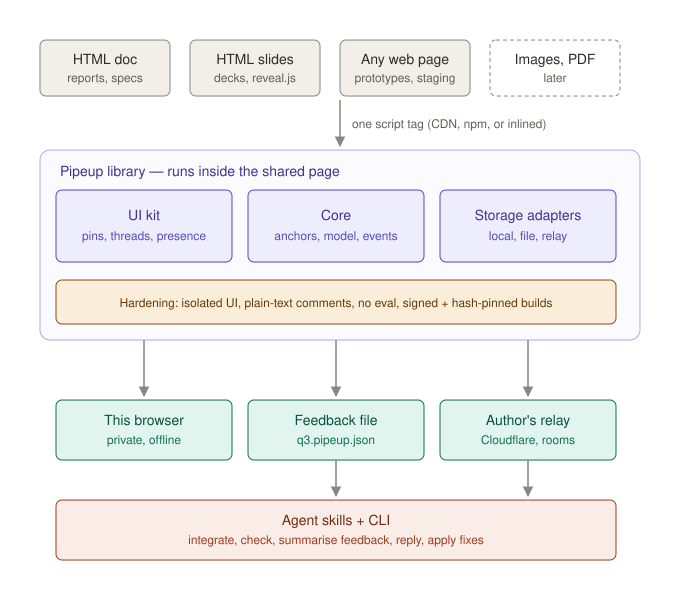
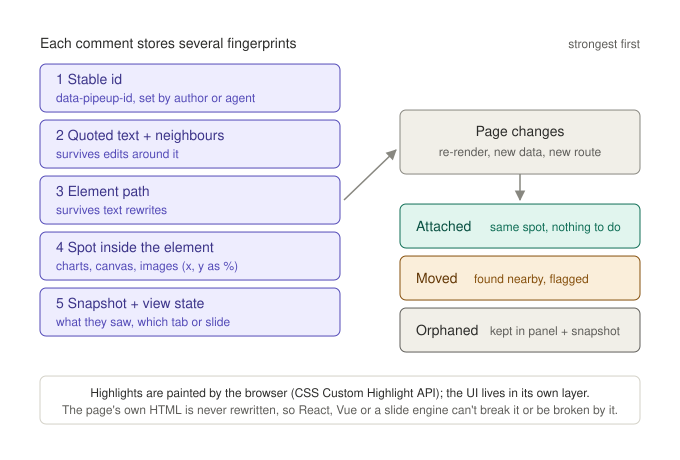
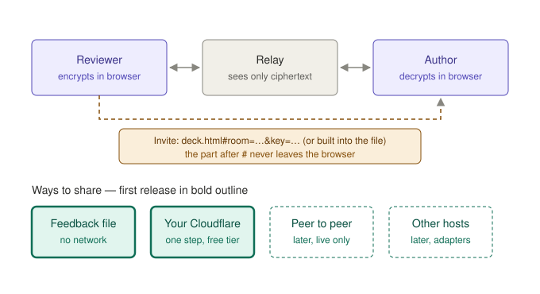
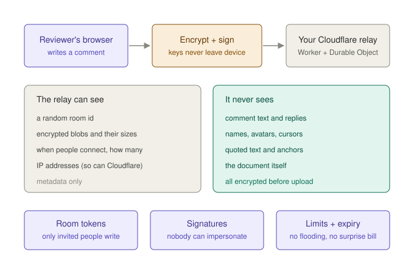
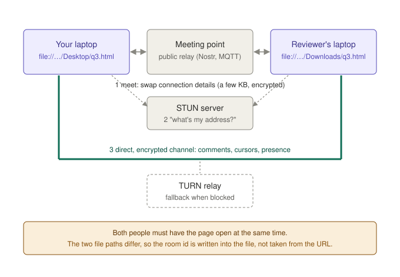

# Pipeup — Architecture (dev design)

**Status:** Draft for review · **Last updated:** 2026-10-06
**Implements:** [FUNCTIONAL_SPEC.md](../FUNCTIONAL_SPEC.md)
**Mock-ups:** kept with the maintainers (not in the public repository); the website's Try pages show the built UI

This is the *how*. Requirements live in the functional spec; anything here can change without
changing what Pipeup promises.

---

## 1. Big picture



| Unit | Path | Manifest | Ships as |
|---|---|---|---|
| Browser library (core + UI + storage adapters) | `libs/ts/pipeup` | `package.json` | npm `pipeup`; CDN builds |
| CLI (`check`, `merge`, `summary`, `relay deploy`) | `apps/cli` | `package.json` | npm bin |
| Relay | `services/relay` | `package.json` (Wrangler) | Deployed by each author to their own Cloudflare account |
| Agent skills | `apps/agent-skills` | none (markdown) | Bundled with the CLI and published alongside |

Language: TypeScript throughout. The library has **zero runtime dependencies** — a smaller
attack surface and an easier audit.

### Build outputs

- **Classic IIFE bundle** (`pipeup.min.js`) — the default. It works from `file://`, where Chrome
  refuses local ES-module scripts.
- **ESM bundle** for bundler users.
- Every release publishes **SRI hashes** and a signed provenance attestation (npm provenance).
  Docs always show the pinned form:
  `<script src="https://cdn.jsdelivr.net/npm/pipeup@1.2.3/dist/pipeup.min.js" integrity="sha384-…" crossorigin="anonymous">`.

## 2. Library internals

```
core/      model (threads, comments, ops), anchoring, re-anchor loop, events API
ui/        custom element <pipeup-root> with an open shadow root; gutter, drawer, pins, panel
adapters/  slide adapters (generic, reveal.js, …) — current slide, go to slide, slide element
storage/   local (IndexedDB), file (export/import), relay (WebSocket)
crypto/    room + document keys, signing identities, envelope format
```

### Not touching the host page

- All UI renders inside **one `<pipeup-root>` element under `<html>` with an open shadow root**
  (open so `pipeup check` and agents can measure it), a fixed click-through layer and a
  constructed stylesheet. Page CSS can't reach in; our CSS can't leak out. Text highlights use a
  constructed stylesheet adopted by the document, so no `<style>` is ever added to the page.
- Text highlights use the **CSS Custom Highlight API** (`CSS.highlights`), so the page's DOM is
  never wrapped or mutated. React or Vue reconciliation is unaffected.
- Pins and gutter cards are positioned from `getBoundingClientRect()` and updated by
  `ResizeObserver`, `IntersectionObserver` and scroll listeners, batched with `requestAnimationFrame`.
- Pipeup never calls `eval`, never uses `innerHTML` with comment content, and runs under a
  strict page CSP (`script-src` for its own origin plus a hash; no `unsafe-inline` needed for styles,
  which are adopted stylesheets).

### Theming

Pipeup reads the computed `font-family`, `color-scheme` and an accent colour (from
`--pipeup-accent`, otherwise the colour of the first link) from the host page and maps them
onto its own tokens.

## 3. Anchoring



Built on the W3C Web Annotation selector model (the approach Hypothesis has proven). Each anchor
stores, in order of strength:

1. `data-pipeup-id` of the nearest marked element;
2. `TextQuoteSelector` — exact text plus 32 characters of prefix and suffix;
3. element path — a CSS path from the nearest stable ancestor;
4. a point within the element as fractions of its box (charts, canvas, images, slide pins);
5. a snapshot — the quoted text, a short text context, and the view state (`route`, `slide`,
   `step`, plus anything the page supplies via `pipeup.setViewState()`).

**Re-anchor loop.** A debounced `MutationObserver` re-resolves affected anchors. Resolution
tries the selectors in order. A fuzzy text match (bounded edit distance) scores the result:
exact → *Attached*, fuzzy or found via a weaker selector → *Moved*, nothing → *Orphaned*.

**Hidden views.** Pages register `pipeup.onReveal(viewState => …)` so the panel can reopen a
tab, route or slide. Slide adapters implement this for decks.

**Document versions.** A document fingerprint (a hash of normalised text per marked block) is
saved with each comment. A changed block hash downgrades *Attached* to *Moved*.

## 4. Data model and sync

A document's feedback is an **append-only log of signed operations**:
`create`, `reply`, `edit`, `delete` (tombstone), `resolve`, `reopen`. Current state is a fold
over the log: last-writer-wins per field, ordered by (Lamport clock, time, author key, op id).
This is simpler than a general CRDT library (such as Yjs), every op is easy to sign, and merging
feedback files becomes a set union.

- **Content-addressed op ids.** An op's id is the base64url SHA-256 (all 32 bytes, 43 chars) of
  its canonical body without `id` (and, for `create`, without `thread`, which must equal the id).
  Every op is re-hashed on import before its signature is checked, so nobody can claim another
  person's op id with different content, and union-on-id merging is safe.
- **Bounded clock.** Valid ops have clock ≤ 2^40 and time ≤ 2^47 ms; new ops never fail at the
  caps — they stay at them. A reply, edit, delete, resolve or reopen is timed after the latest op in
  its thread, so it follows what it answers even when devices' clocks disagree; a new thread is
  timed after its writer's previous thread. Threads fold independently, so a far-future (or capped)
  time posted into one thread only affects ordering inside that thread — at the caps that thread's
  order falls back to author and op id — and never another thread or another writer's other ops.
  Writing is never blocked. In a thread pushed to both caps (only possible by a participant who
  deliberately signs such an op), edits, deletes and resolve/reopen may not take effect, and two
  identical new threads by one writer merge into one; other threads are unaffected. A later
  tie-break on op kind could recover edits and deletes there. Phase 2 relays may bound times by
  receive time.
- **Validation limits** (`LIMITS` in `src/model/ops.ts`): text ≤ 10,000 UTF-16 units, trimmed;
  names 0–80 chars, trimmed ("" is a reviewer with no name, shown as their animal); anchors fully typed with size caps; unknown extra fields are not yet
  rejected (make the v1 schema strict before the relay ships).

- **Local**: ops are kept in IndexedDB, keyed by document id.
- **Feedback file** (`<doc>.pipeup.json`): a header (format version, document id) followed by
  sealed ops. Importing a file is a union on op id, so duplicates collapse.
- **Relay**: the same sealed ops over a WebSocket. On reconnect the client sends its highest
  known sequence number per author and receives what it's missing.

**Presence** uses ephemeral messages over the same socket (cursor, slide, typing). They are
sealed, rate-limited client-side to about 15 Hz, and never stored.

## 5. Sharing and relay



### Relay on Cloudflare

- One **Worker** routes `wss://<relay>/r/<roomId>` to one **Durable Object per room**
  (SQLite-backed storage, WebSocket Hibernation so idle rooms cost nothing).
- The Durable Object stores sealed ops, fans out ops and presence to connected sockets, and
  enforces per-room limits (bytes stored, ops per minute per connection, maximum connections).
- An **alarm** deletes rooms after the inactivity TTL.
- About 300 lines of code, no dependencies besides Wrangler at build time.
- `pipeup relay deploy` wraps `wrangler deploy`. The author signs in with Wrangler's own
  login — we never handle their Cloudflare credentials.
- On the free plan, exceeding limits returns errors rather than billing. The exact current free
  limits for Workers, Durable Objects and storage must be verified at build time and recorded here.

### Keys and tokens

| Secret | Created by | Lives | Purpose |
|---|---|---|---|
| Document key (AES-256-GCM) | Integration (CLI or agent) | In the file (`data-pipeup-doc`) | Seals feedback files |
| Room key (AES-256-GCM) | Author, when a room is created | Invite fragment, or in the file | Seals ops and presence |
| Room write token | Relay, signed with the author's relay admin secret | Invite | Relay admits writers |
| Identity key (Ed25519) | Each browser, on first comment | IndexedDB, non-extractable | Signs every op |
| Relay admin secret | `pipeup relay deploy` | Wrangler secret plus the author's machine | Creates, lists and deletes rooms |

Invites look like `…/deck.html#room=<id>&key=<k>&t=<token>`, or a short code for pages opened
from disk. The fragment never reaches any server.

## 6. Security model



| Threat | Mitigation |
|---|---|
| Relay or Cloudflare reads comments | All ops and presence sealed client-side with the room key |
| Strangers spam a relay or fill its storage | Signed write tokens; per-room quotas, rate limits, TTL; free plan fails closed |
| Impersonation, or tampering by members or the relay | Every op signed with Ed25519; the relay verifies signatures on write; clients verify on read |
| Relay drops or withholds ops | Per-author sequence numbers reveal gaps; the UI shows "some comments may be missing" |
| XSS through comment content | Text rendered with `textContent` only; links detected and rendered as `<a rel="noopener noreferrer">`, `https:` only |
| CDN or package tampering | SRI-pinned script tags; npm provenance; signed tags in the repository |
| Leaked room key | Close the room and start a new one. No forward secrecy in v1 — documented plainly |
| Malicious host page reads Pipeup data | Out of scope: the page owner controls the page. Pipeup says so in its docs |

Ed25519 in WebCrypto is supported in current Chrome, Safari and Firefox. Verify the minimum
versions during phase 1. There is no third-party fallback: Pipeup and its add-ons bundle no outside code.

## 7. Platform findings (spike, 2026-10-05)

A test page opened from `file://` in headless Chrome on macOS:

| Capability | Result |
|---|---|
| `isSecureContext` | `true` |
| WebCrypto AES-GCM | works |
| localStorage, IndexedDB | work |
| WebRTC data channel (loopback) | message delivered |
| WebSocket to a public `wss://` relay | connected |

Still to test: **Safari and Firefox** (Firefox isolates each `file://` document by default, which
may affect IndexedDB persistence). Local ES modules fail from `file://`, hence the classic bundle.

### S5: CDN file names with `+` (add-ons spike, 2026-10-07): passed

Combined files are named `pipeup+<id>.min.js` ([add-ons design](addons.md) §13). Tested with an
existing npm package that ships `+` file names (`timezone@1.0.23`, `Etc/GMT+1.js`); nothing was
published.

| Check | jsDelivr | unpkg |
|---|---|---|
| `+` in the path, raw or as `%2B` | 200 | 200 |
| Content type | `application/javascript; charset=utf-8` | `text/javascript; charset=utf-8` |
| `access-control-allow-origin: *` (needed for SRI) | yes | yes |
| Bytes equal to the npm tarball's (SHA-384) | yes | yes |
| `<script integrity crossorigin>` from `file://`: Chrome (Playwright Chromium), Firefox 153, Safari 27 | loads | loads |

A wrong-hash control was refused in all three browsers, so the SRI check ran. A space in place of the
`+` gives 404, so neither CDN reads `+` as a space. jsDelivr gives `/+esm` at the end of a path a special
meaning; `pipeup+<id>.min.js` doesn't end that way, and an existing `.min.js` is served unchanged. The
fallback name `pipeup-with-<id>.min.js` isn't needed.

### S1: PrivateBin from `file://` (add-ons spike, 2026-10-07): own instance passed; volunteer instances to do

PrivateBin **2.0.6**, the official Docker image (`privatebin/nginx-fpm-alpine`) with its built-in
defaults, on this Mac. A `file://` page in Chrome 154, Chromium 153 (Playwright), Firefox 157 and
Safari 27 sent only simple requests: `text/plain` POST bodies, `Accept: application/json`, no
credentials.

| Check | All four browsers |
|---|---|
| Web Locks (`navigator.locks.request`) on `file://` | granted |
| Create a paste (`v: 2`, `meta.expire`), JSON answer | HTTP 200, `status: 0`, an id |
| A second post within 10 s | HTTP 200, `status: 1`, "Please wait 10 seconds between each post." (not a 429) |
| A comment in the [add-ons design](addons.md) §7.2 mapping, with a real sealed envelope as `ct` | accepted (`status: 0`) |
| GET `?<id>` with `Accept: application/json` | JSON, with the comment's `ct` returned unchanged |
| `meta.time_to_live` after asking for `1week` | about 604,780 s |
| `meta.time_to_live` after asking for `2year` (not offered) | about 604,770 s: silently the default, 1 week |
| `meta.time_to_live` after asking for `never` | absent |
| Preflight (`OPTIONS`) in the server log | none |

From the 2.0.6 source (`lib/FormatV2.php`, `lib/Request.php`, `lib/Controller.php`):

- The server rebuilds each request from the fields it knows. A comment is exactly `v`, `adata` (the
  8-item cipher spec), `ct`, `pasteid` and `parentid`. Any **non-empty `meta` turns the request into a
  new paste**; an empty one is ignored.
- Limits: the iv at most 24 base64 characters, the salt at most 14, iterations above 10,000, key 128,
  192 or 256, tag 64, 96 or 128, `aes`, `ctr`/`cbc`/`gcm`, `zlib` or `none`. `ct` must be strict
  standard base64 that doesn't shrink under deflate. 16-byte iv and 8-byte salt fit (24 and 12
  characters).
- Any POST body is parsed as JSON whatever its `Content-Type`. JSON answers come with
  `Access-Control-Allow-Origin: *` when `Accept` holds `application/json` (and not HTML), or with
  `X-Requested-With: JSONHttpRequest`.
- Defaults: discussions on, expiries 5 min to 1 year plus `never` (default 1 week), one post per
  address every 10 s, 10 MiB size limit.

**Still to do for S1:** the same checks on one or two volunteer instances, with their operators'
permission, and over HTTPS on a public instance.

### S3: Web Speech from `file://` (add-ons spike, 2026-10-08): passed in Chrome and Safari

A `file://` page (`lang="en-US"`) in visible windows, with the maintainer speaking into the Mac's
microphone and answering the browsers' prompts.

| | Chrome 154 | Safari 27 | Firefox 157 |
|---|---|---|---|
| API | `SpeechRecognition` | `webkitSpeechRecognition` | none |
| `available()`, `install()`, `processLocally` | all three | none | — |
| On device, en-US, before `install()` | `downloadable` | can't be asked | — |
| Through the browser's service, en-US | `available`; dictation worked, final text about 2.4 s after speech began | dictation worked, the words right, final text about 4.8 s after speech began | — |
| On device after `install()` | `install()` answered `true` at once (the pack was probably on this Mac already); dictation worked, final about 3.9 s after speech began | — | — |
| Interim results | 11 to 19 updates per sentence | about 11 | — |
| Microphone grant after a reload | asked again | asked again | — |

- **The microphone grant doesn't last on `file://`:** both browsers ask again on every page load, and
  Chrome's `permissions.query` still says `prompt` after a granted run.
- **Safari can't say where it listens:** with no `available()` or `processLocally`, a page can't tell
  on-device recognition from Apple's service.
- **One recognition at a time in Safari:** a second `start()` aborts the first ("Another request is
  started"), and one started straight after fails at once with "No speech detected".
- Edge wasn't installed and wasn't tried; it uses Chrome's engine.

### S6: the HTTP mailbox from `file://` (add-ons spike, 2026-10-07): public host and private address passed; TLS on a private address to do

A throwaway server with the page-facing `pm1` endpoints ([add-ons design](addons.md) §7.7), on this
Mac, reached from a `file://` page at `127.0.0.1` (loopback) and at the Mac's LAN address (a private
address), over plain `http:`.

| Check | Chrome 154 | Chromium 153 (Playwright) | Firefox 157 | Safari 27 |
|---|---|---|---|---|
| `GET …/ops?since=` with `Accept: application/json` | 200 | 200 | 200 | 200 |
| `POST …/ops`, `text/plain` body; the same POST again | 201, then 200 | 201, then 200 | 201, then 200 | 201, then 200 |
| 429: status, exposed `Retry-After` and `retryAfter` in the body readable | yes | yes | yes | yes |
| `keepalive` POST at `pagehide` arrives | yes | yes | yes | yes |
| Preflight (`OPTIONS`) sent | none | none | none | none |
| Local-network prompt or `Access-Control-Request-Private-Network` | none | none | none | none |

The same results came from both loopback and the LAN address. Every request carried `Origin: null` and
no cookies. Requests to the LAN address carried no `Sec-Fetch-*` headers, because plain `http:` to it
isn't a trustworthy origin. Chrome 154 neither prompted nor sent a private-network preflight for a
`file://` page reaching a private address.

**Public host over TLS.** The same checks against a Cloudflare Worker on `workers.dev` (HTTPS, HTTP/2),
deployed for the test and deleted straight after. Chrome 154, Chromium 153, Firefox 157 and Safari 27
all passed every row above: no preflight, the 429 readable, the `keepalive` POST at `pagehide` arrived,
`Origin: null` and no cookies. A brand-new `workers.dev` subdomain took about two minutes to get its
certificate.

**Harness note.** macOS `open` drops the `?query` and `#fragment` from `file://` addresses; the Safari
and Chrome runs passed the address through AppleScript instead.

**Still to do for S6:**

- The same checks over **TLS on a private address**, with a certificate the browsers trust (an
  intranet's own CA). Local-network rules may treat secure and plain requests differently.

### Peer to peer (deferred)



Kept for a later phase. It works from `file://`, but it needs public signalling, STUN, and TURN
for strict networks, and it only works while people are online at the same time.

## 8. Check (`pipeup check`)

The CLI uses Playwright with Chromium. For each width (375, 768, 1440):

1. Load the page with Pipeup disabled and record the boxes of all visible elements.
2. Load it with Pipeup enabled and closed, record again, and diff. Any shift beyond 0.5 px fails.
3. Hit-test Pipeup's closed UI against page content and interactive elements. Overlap fails.
4. Count marked blocks, charts and slides. Unmarked ones produce a warning.
5. Run axe-core over Pipeup's shadow root for contrast and keyboard reachability.

Output: a human-readable table by default, and `--json` for agents. The exit code is non-zero
on any fail.

## 9. Agent skills

Skills are shipped as markdown in `apps/agent-skills/`:

- `pipeup-integrate` — add the script with pinned SRI, document id, `data-pipeup-id` on
  blocks, `ignore` on chrome, a slide adapter for decks; then run `pipeup check` until it passes.
- `pipeup-summarise` — read feedback files or a room export and group threads by section,
  theme and state.
- `pipeup-apply` — for threads the author approved: edit the page, reply with what changed,
  resolve.

## 10. Testing

- Unit tests: the op log fold, merge, signing and sealing, the selector resolution ladder.
- Anchoring fixtures: a corpus of dynamic pages (React re-render, virtual list, tabs, reveal.js
  deck, canvas chart) with scripted mutations and expected states.
- Browser matrix: Chromium, WebKit and Firefox via Playwright, both `file://` and `https://`.
- Relay: Miniflare or Wrangler local tests for quotas, TTL, token checks and signature rejection.
- Security: fuzz comment text for XSS; tests that the relay rejects forged ops.

## 11. Interaction design

The interactive mock-ups are the reference for look and feel. `mockups/pipeup-mock.js` is a
throwaway prototype of the UI layer (no storage, sync or security) shared by the deck and website
examples; the document page has its own gutter prototype.

| Mock-up | Shows |
|---|---|
| `comment-viewing.html` | Document column, text selection, threads, replies (shown nested; superseded by the one-level layout below), resolve, menu, copy for AI |
| `example-deck.html` | Six-slide deck: per-slide bubbles, pins, comment mode, keyboard navigation |
| `example-site.html` | Rich landing page: controls as targets, text highlights as targets, menu |
| `motion-playground.html` | Each motion rule, with a snap comparison and reduced-motion preview |
| `review-surfaces.html` | First static mock-up (superseded, kept for history) |

### Plan 2A (built)

- **Column vs bubbles.** `columnSpot` gives the document column its place (viewport x and
  width) when the commentable area is an `article`/`main` with at least 300 px free beside it,
  and returns nothing for slide pages and narrow windows; those use bubbles with popovers. The
  choice is read, never written: authors can force either with `<html data-pipeup-layout="column|bubbles">`. In 2A the column always sits to the right.
- **Resolve time budget.** Anchors resolve in passes of at most 40 ms; threads that run out of
  budget get only the exact match first and are shown as unplaced (not lost) until a deferred
  pass (250 ms later) gives them the fuzzy match, so they never flash as lost.
- **Three bundles.** `dist/pipeup.min.js` (classic script: core + UI + auto-mount, at most 40 KB
  gzipped), `dist/pipeup.esm.js` (core + UI for bundlers, no side effects, at most 40 KB) and
  `dist/pipeup.core.js` (core only, at most 12 KB), raised in Plan 2B, to 33 KB (min, esm) for 0.4 part 1
  to 36 KB for 0.4 part 2 (the keyboard cursor; touch and the drawer moved to 0.5) and to 40 KB for 0.4.1 (Tab in comment mode), see §11. `scripts/size.mjs` enforces the
  budgets.

### Motion tokens (starting values)

| Token | Value | Use |
|---|---|---|
| `enter` | 0.26 s, `cubic-bezier(.22,.61,.36,1)` | Fades and rises in |
| `move` | 0.32–0.36 s, `cubic-bezier(.4,0,.2,1)` | Outline glide, threads shifting, popover moves |
| `exit` | 0.20 s, `cubic-bezier(.4,0,1,1)` | Fades out |
| `roll` | 0.52 s | Count changes |
| `pulse` | 1.1–1.3 s, ease-in-out, single cycle | Content ↔ comment connection |
| cursor smoothing | τ = 0.12 s exponential | Remote cursors between updates |
| reduced motion | 0.16 s opacity cross-fade | Replaces all movement |

Positions that track scrolling content update every frame with no transition; transitions apply
only when the *target* changes. Direct drags have no transition.

### Thread anatomy

- At rest: comment text (14 px) + faint reply count. Nothing else.
- Hover: a footer with author · time followed directly by icon actions (thread: copy, resolve) eases open
  *beneath* the text (`height` 0 → 22 px) for the hovered comment only. At rest it has zero height —
  no reserved row — unless it carries a reply count. Replies have the same footer with no actions
  (the writer's own edit and delete aside).
- Open: `inset 2px 0 0` accent line on the left, no background; other threads at 45 % opacity;
  a persistent reply line (an underline only) at the end.
- Replies: all replies sit one level in (14 px indent) beneath the root comment, oldest first.
  There is no reply-to-a-reply action. The op format keeps its `parent` field, so older data with
  replies to replies still folds; the UI shows those replies in the same indented list by time.
- One reply line (an underline only, no icon or placeholder), always last, at the reply indent; its input
  starts at the replies' text edge. A press anywhere on the line (`.row`, `cursor:text`) focuses the input with
  the caret at the end; hover darkens its underline with the enter timing.
- Text comments have no bubble: hit-testing uses the highlight range's client rects.

### Copy for AI

There is no copy-format option. The menu has two rows: Copy as Markdown (`'ai'`) and Copy as Text
(`'text'`); the core `copyAll`/`copyThread` keep their `CopyAs` parameter for tools. Copy on a thread always
copies the whole thread, as Markdown. Markdown output for one thread:

```markdown
## Thread 1 · open
- **Where:** Slide 3 "Revenue grew 42% year on year" › Q4 bar
- **Element:** `[data-pipeup-id="s3-q4"]` (Q4 bar)
- **Pin:** 50% across, 6% down the element
- **Started by:** Sam, 18m ago · 1 reply

**Sam** (18m ago): Make Q4 the only coloured bar so it reads at a glance.
- **Amy** (10m ago): Already is — maybe darken the label?
```

Copy as Markdown (`copyAll('ai')`) prefixes `# Review comments: <title>`, page URL, export time, open count (resolved
excluded) and a one-line instruction, then `## Thread N` blocks in page/slide order.

### Plan 2B (built)

- **Comment mode first.** Sites can only be commented on by selecting text until comment mode
  lands, so it leads Plan 2B: the control's Comment button and **⇧⌥C** (Shift+Alt+C) toggle it; hover glides an
  outline to the obvious block (§5 of the spec); click chooses it, opens the comment box on it
  and shows the naming bar with the expand icon (moves the box to the block around it); Option-click drops a pin; Esc leaves. The page's own handlers are
  suppressed in capture phase while it is on; `data-pipeup-ignore` areas keep working.
- **Hover previews wait.** The preview stays while the pointer is over the highlight/bubble *or*
  the preview, and hides 400 ms after it leaves both (cancelled on re-entry). The preview takes
  pointer events and opens its thread on click. Clicking a highlight, bubble or preview always
  opens (`ctx.open(id)`, never `active === id ? null : id`); Esc, a click on the page outside
  Pipeup, or opening another thread closes.
- **Room for All comments.** While the panel is open the same adopted stylesheet gives `html` a right
  margin of the panel's width (easing in and out) and publishes it as `--pipeup-panel`. A margin moves
  normal content but not fixed elements or sizes in `vw`, so pages with fixed bars offset them with
  `var(--pipeup-panel,0px)`; the site's Try bar and slide controls do.
- **Reserved gutter (opt-in).** A page opts in with `<html data-pipeup-reserve>`.
  Pipeup then publishes the gutter width as a custom property from its document-adopted
  stylesheet — `:root{--pipeup-gutter:320px}` while the column shows, `0px` otherwise — and never
  touches the page's DOM or inline styles. The page's own CSS consumes it, e.g.
  `body{padding-right:var(--pipeup-gutter,0px);transition:padding-right .34s cubic-bezier(.4,0,.2,1)}`
  with the reading area `margin-inline:auto`. For reserving pages the column decision uses
  `viewport width ≥ content max width + gutter` (with 24 px hysteresis) rather than measured free
  space, so publishing the gutter can't flip the decision back. As built, the content width is the
  reading area's computed `max-width` when it is in px; when it is a percentage, the share of the window
  (so the hysteresis band scales by 1/(1-p)); otherwise the measured width alone. A fluid page with no
  limit therefore never gets a column. Pages without the attribute are unchanged: free-space
  measurement, no custom property.
- **Skills.** `pipeup-integrate` splits into *creating* a page for review (layout per page type,
  including the reserved gutter for documents) and *adding* Pipeup to an existing page (no layout
  changes, as before), plus a reference for every `mount()` option and markup attribute.
- **One file, not lazy loading.** Loading comment mode and the menu on first use was considered and
  rejected: a second file from `file://` needs its own request, and Chrome refuses every `integrity` check
  on `file://` (even with the right hash), so a split build would either lose integrity or break pages opened
  from disk. `file://` support wins. The classic and ESM bundles carry everything, with budgets of 26 KB
  gzip (core 12 KB), held by trimming: replies render one level, previews and popovers share one placement
  (`popoverAnchor` + `placePopover`), drafts share `draftBox`, overlays share `fit`.
  The build minifies the stylesheet (`STYLES`) with esbuild's CSS minifier, so its source keeps comments and
  line breaks. Measured after the Plan 2B review fixes: pipeup.min.js 25.0 KB, pipeup.esm.js 24.6 KB,
  pipeup.core.js 8.2 KB (gzip).
- **Replies fold one level.** `foldThreads` appends every reply to the comment's list in op order, whatever it
  answered; the `target` field is kept, so older data still folds.
- **Comment mode** (`src/ui/comment-mode.ts`) is a view the app creates when comment mode turns on. It listens
  on `window` in the capture phase: `click`, `dblclick`, `auxclick`, `submit` are prevented and stopped;
  pointer/mouse presses, releases, moves and over/out/enter/leave are stopped (presses on controls also
  prevented, so nothing focuses or opens); Enter or Space on a page control is prevented; `contextmenu` and
  `dragstart` are swallowed and touch is muted. Pipeup's own window listeners (selection, the menu) still
  run, whatever order they were added in, because `stopPropagation` never stops other listeners on the same
  node (`window`); only `stopImmediatePropagation` would. Presses are prevented only on real controls, not
  on text wrappers such as `tabindex="-1"`, `details` or `label`, so text stays selectable. Leaving comment
  mode removes the listeners at once and fades the outline and bar out before removing them.
  Block picking (`src/ui/pick.ts`) is pure and unit-tested with a fake layout. Esc goes through the app's
  `back()`: draft (which closes its chosen block with it), open thread, comment mode. A click on a block calls
  `commentOn`: it chooses the block and starts the draft (or `moveDraft`s an empty open one there). `moveDraft`
  mutates the open draft in place, so the box keeps its words and focus; the popover then glides (opacity
  only under reduced motion). The chosen block's outline stands in for the popover's `.mark` while comment
  mode is on.
  Known limits, by nature of a library: CSS `:hover` still applies; a page's own window-capture listeners
  registered before Pipeup still hear events; Esc reaches the page's key handlers; the browser's own
  right-click menu is suppressed in comment mode (it could be left alone with a stop-only handler).
- **Details that matter.** A draft takes focus when it attaches (no timers: a late timer stole typing and
  collapsed new selections). Hidden bars (the naming bar, the selection icon) are inert, so they take no
  focus. Bubbles scale from their tip, so a hovered, open or pinned bubble keeps pointing at the same spot;
  bubbles and the pending pin fade in with the enter timing and out with the exit timing (`.bub:not(.in)`).
- **Reserved gutter** is published by `installPageSheet` (the same adopted sheet as the highlights); the
  column sits 24 px inside the gutter, 272 wide.
- **Tests.** Browser tests are type-checked with the rest (`tsconfig.e2e.json`, part of `npm run check`).
- **Names and animals.** A name is optional. Ops may carry `name: ""`; `foldThreads` shows such a comment
  with the writer's latest name in the document (any op of theirs that carries one), and
  `PipeupDocument` with the reader's own current name for their comments, so adding a name relabels the
  writer's earlier comments too. Anyone still without a name is shown as an animal in a colour ("Red Fox"):
  `src/model/animals.ts` (core) holds the 5 animals (Otter, Fox, Owl, Bear, Rabbit) and 10 colours (Red …
  Grey) and picks both from one hash of the author's public key (FNV-1a, mixed): animal `h % 5`, colour
  `floor(h / 5) % 10`, so the two are independent and all 50 come up evenly. One identity is the same
  animal in the same colour everywhere; `animalName` gives "<Colour> <Animal>" and `nameOf` is what hover
  details, the draft's "You're …" line and copy for AI print. The animal pick kept its old hash, so the
  cut from 25 animals to 5 (2026-10-06, to save about 1.8 KB gzip) only remapped by the new modulus.
  `src/ui/animals.ts` holds the drawings (one 24×24 stroked path each, drawn for Pipeup, keyed by animal) and
  the squircle `avatar` (`data-animal` is the full "Red Fox"): the animal drawn in its colour's dark stroke
  on a tint of it, or the writer's initial in the same pair. The ten pairs are `.c0`–`.c9` in COLOURS order,
  each just a hue (`--h`) and, for Brown and Grey, a saturation (`--s`, default 60%), with two lightness
  variables on `.av` (tint 92% / stroke 30%; on dark pages 20% / 78%). A unit test reads those values from
  the stylesheet and checks every pair, light and dark, for at least 3:1 contrast. Profiles created before
  this kept the name "Reviewer", which now reads as no name.
- **Avatar placement.** `.root` and every reply `.it` keep 30 px of padding on the right whether or not an
  avatar is there; the avatar is positioned absolutely in it at the top right, so the words' width never
  depends on it. Thread views keep each avatar element across updates (keyed by comment and face) and only
  ease in new ones, so re-renders never replay the motion.
- **Naming in the draft.** The draft shows the writer's avatar beside the comment line and a quiet line
  ("You're Red Fox · add your name"); its name field shares a grid cell with that line and cross-fades in,
  inert while hidden. Saving goes through the menu's `rename` path. The budgets went from 26 to 30 KB
  gzip for this: the drawings and the new styles cost about 3 KB (pipeup.min.js 29.3 KB, pipeup.esm.js
  28.9 KB, pipeup.core.js 8.6 KB).
- **The comment control and All comments.** The control is `[number][more][comment icon]`, right-aligned,
  so the icon never moves. The number (`.count`) shows only while there are open threads: it eases open to
  the left (its grid column, padding and opacity) and closes the same way, keeping its last value while it
  fades; at zero it is inert. Choosing the number opens **All comments** (`.menu.all`, same panel, keyboard
  and inert handling as the menu); the menu moved to a "more" button (`.opts`) that eases open beside the
  number on hover or focus, so at rest the control is still only the icon. The list comes from
  `MenuActions.all()` (the same page-ordered `ExportItem`s Copy all uses, so each row's place is `locate()`'s
  label), puts threads whose content is gone under "No longer on the page" with their snapshot, and follows
  Show resolved. Choosing a row scrolls its content into view (`scrollIntoView`, which also scrolls
  `overflow:hidden` carousels; smooth unless reduced motion) and opens the thread where it is (column or
  popover). A thread with nowhere to show (orphaned, `display:none`, `visibility:hidden`) opens in a
  popover beside the control (`.pop.side`, placed by `placePopover`, built with `threadView`), which closes
  on Esc, a click elsewhere, or another thread opening. This fixes a count that could not be reached in
  bubbles mode, where orphaned threads had no bubble and no list. There is no reveal API for hidden views
  yet (§8 "reopens that view when the page tells Pipeup how"); when one exists, `choose()` in
  `launcher.ts` is where it goes. The budgets went from 30 to 32 KB gzip for this (pipeup.min.js 29.9 →
  31.1 KB, pipeup.esm.js 29.6 → 30.8 KB, core unchanged at 8.6 KB).
- **One button, and All comments as a panel (2026-10-06).** The control above became one 46 px round
  button (`.launch .mode`): the comment-plus icon (`.plus`) and, while threads are open, a larger comment
  bubble (`.cnt`, the `bubble` icon) with the count inside, cross-fading between the two. The count is two
  stacked spans (`.n`); a change writes the hidden one and swaps `.on`, so the old number fades out as the new
  one fades in; above 99 it reads "99+". Nothing about the button changes size. A CSS tooltip (`.ttip`,
  "Comment" and `SHORTCUT_LABEL`) eases in after 0.5 s on hover or keyboard focus, hidden while the menu is
  open and on `hover:none` screens. The slide-out words and the "more" button are gone. A click opens the menu
  (`aria-haspopup="menu"`), which rises above the button and is built top down so **Comment** (or Stop
  commenting) is last, nearest the button, with its shortcut (`aria-keyshortcuts`); opened from the keyboard,
  focus starts there. Comment mode shows as the accent fill (`.mode.on`); while comments are hidden the button
  still opens the menu and the Comment item is `aria-disabled`. **All comments** is a dialog (`.all`): fixed
  full height on the right, 320 px (the whole width at 480 px or less), sliding in with the move token and out
  with the exit token (opacity only under reduced motion), inert when closed, focus in on open and back to the
  button on Esc or its close button. It sits above the button in the layer. `UiState.listing` says it is
  open, so other views can make room: `room(listing)` in `layout.ts` is the viewport less the panel, and every
  popover, preview and the side popover is placed within it, so the panel never covers the thread it opens.
  **Column vs panel:** the column sits where the panel goes, so while the panel is open the column fades and
  goes inert (`.layer.listing .col`) and the bubbles view, normally without popovers in the column layout,
  opens the chosen thread as a popover beside its content (`pops()` in `bubbles.ts`); drafts still go to the
  column, and starting one or entering comment mode closes the panel. Closing the panel gives the column back
  with the thread open there. This was simpler than shifting the column (which would land on the content) and
  reuses the popover path bubbles already have. On a narrow screen the full-width panel closes when a thread
  is chosen. The panel's avatars stretched to the row's width (the row's `span{flex:1}` caught the avatar
  span); the text span is now the flexible one and the avatar is `flex:none`.
  Polish: `PANEL`, `POPOVER` and `NARROW` live only in `layout.ts`; the host writes the first two onto the
  layer as `--pu-panel` / `--pu-pop` (the stylesheet must stay one plain template literal for the build's CSS
  minifier, so nothing is interpolated into it), and narrowness is decided in code, which gives the panel
  `.full`. The column fades out under the panel with the exit timing. Focus that was in the panel when a page
  click closes it, and that the click left on nothing (`body`), returns to the button; a click into a page
  field keeps its focus. All comments has its own `list` icon.
- **A simpler menu; comments follow comment mode; the panel makes room (2026-10-06).** This supersedes the
  menu details above (Comment / Stop commenting, Copy as, Show resolved and Hide comments rows).
  - *Menu.* `launcher.ts` builds the rows once and `sync()` updates them in place (labels, `aria-checked`,
    counts), so switches ease instead of being rebuilt on every render; name editing swaps the rows for the
    field and back. Each row is one line (`.lb`, ellipsis) with its explanation in an `aria-hidden` tooltip
    (`.tt`, beside the menu, 0.5 s delay, enter/exit tokens, hidden on `hover:none`) mirrored to
    `aria-description`. Order: identity row (`[data-item=name]`, avatar `.ma`, "Add name" or the `edit`
    pencil, `aria-label` "<name>, add/edit your name"), separator, Copy all, Copy all as text (two plain rows), All
    comments, separator, Start commenting (`menuitemcheckbox` drawn as a switch, `aria-keyshortcuts`).
    The UI has no feedback-file controls or drop handling; the sealed file format stays in the core.
    Switches (`.sw`) slide their knob with the move token; reduced motion cross-fades two
    knobs (`::after` off, `::before` on). Switch rows in the menu are `menuitemcheckbox` (valid inside
    `role="menu"`); the panel header's Show resolved, outside any menu, is `role="switch"`.
  - *Visibility.* `UiState.hidden` is derived in `render()`: hidden unless comment mode is on, All comments
    is open, a draft is open (its words are never lost), or `reading` is set (a thread chosen on a narrow
    screen, where the panel closes on choose; cleared when that thread closes). Hidden closes the open
    thread. Views already drop hidden threads with their exit fades; highlights cannot transition, so
    `paint()` keeps painting ranges and `fadeHighlights()` tweens the page sheet's highlight alpha
    (`sheet.fade(k)`, 0.26 s ease-out in, 0.2 s ease-in out, opacity-only by nature, so the same under
    reduced motion). `toggleHidden` is gone; `setCommenting(true)` is never refused. Selection offers its
    icon only in comment mode. Because comments are only seen in comment mode, a highlight there previews on
    hover and opens on click, except while a draft with words is open (`ctx.readsAt`, one rule for hover,
    click and comment mode) or with Option held. Comment mode's `onPick` returns early when `readsAt` hits,
    so a click never also picks the block whatever order the capture listeners were added in (views are
    rebuilt when a resize crosses the column/bubbles breakpoint). Choosing from All comments no longer
    leaves comment mode.
  - *Panel room.* `sheet.room(px, still)` adds `html{margin-right:320px!important;transition:margin-right
    .34s …!important}` to the document-adopted sheet while the panel is open on a wide screen; on close the margin goes
    and the transition stays 0.4 s so the page eases back, then the rule is removed. No DOM or inline-style
    writes. Reduced motion: no transition. After the reflow the app re-resolves and re-renders (the root's
    ResizeObserver also fires during it). On reserve pages the gutter closes while the panel makes its room.
    The column still fades and goes inert under the panel: the page has room now, but the column is laid out
    beside content that has just moved and would sit where the panel is, and popovers beside the content
    already show the chosen thread, so keeping that path was simpler and safer. **Known limit:** elements the
    page positions `fixed` (or `sticky` against the window) don't move with the margin and can sit under the
    panel.
  - Sizes after this change: `pipeup.min.js` 31.6 KB, `pipeup.esm.js` 31.3 KB, core 8.6 KB gzip (budgets 32 /
    32 / 12).
- **Menu and picking fixes (2026-10-06).** This updates the menu and picking details above.
  - *Labels.* The copy rows read Copy as Markdown and Copy as Text (same `copyAll('ai' | 'text')`).
  - *Menu stays open.* Start commenting only calls `setCommenting`; render no longer closes the menu when
    comment mode starts, so the shortcut with the menu open keeps it open too (with it closed, it never
    opens it). The menu closes on Esc (capture phase, as before), a click outside the menu and button
    (`onAnyClick`), or when the pointer stays away for 3 s: window capture `pointerover` outside the menu
    and button (or `pointerout` with no `relatedTarget`, leaving the window) starts one timer, `pointerover`
    back inside clears it. Touch pointers are ignored (no hover), and the timer never closes the menu while
    the name is being edited. Copy rows and All comments still close it. In comment mode the outside click
    is consumed: the launcher `claim`s it, prevents and stops it, and comment mode's swallow skips `onPick`
    while `UiState.menu` is set or the click is `claimed` (so either listener order works).
  - *Name in place.* Choosing the identity row swaps that row (not the whole menu) for `.ed`: a copy of the
    avatar and an `input` ("Your name", 80 characters), focused at once. Enter or `blur` saves through
    `menu.rename` (empty or unchanged keeps the name), Esc cancels; both put `idRow` back (Enter and Esc
    focus it). `endEdit` guards against ending twice (removal can blur) and makes the menu's Esc listener
    stand aside, while the field's keydown stops propagation so neither the menu's arrows nor the app's
    Esc see its keys. Closing the menu mid-edit saves. The old "Your name" box (`.name`) is gone.
  - *No blocks over a selection.* Comment mode's `onMove`, and a `selectionchange` listener, hide the
    hover outline while the document has a non-empty selection (its comment icon is the offer); hover
    resumes on the next move once it is cleared. The naming bar only follows a chosen block, so it is
    unaffected.
  - *Picking reaches more.* `OBVIOUS` adds `figcaption`, lists (`ul, ol, dl, dt, dd`), HTML5 containers
    (`section, article, aside, nav, header, footer, main, form, fieldset`) and a short list of ARIA roles
    (widgets, landmarks, structure). `Look.grouped(el)` (computed `display` flex/grid, inline or not)
    makes any element with more than one element child a block, except inside a control (`a`, `button`,
    `label`, `summary`, button/link/tab/option/menuitem roles), whose inner layout is part of it. Innermost
    wins, `data-pipeup-id` wins, the 60 % cap, `data-pipeup-ignore` and same-box wrappers are unchanged.
  - *Site showcase.* The carousel's frame (`.viewport`) is `data-pipeup-id="showcase"` with a label, its
    controls are `data-pipeup-ignore` (they keep working in comment mode), and the moving `.track` has
    `pointer-events:none`, so a pointer anywhere in the stage targets the frame and picks it whole. The
    frame keeps its own swipe listeners.
- **Open question:** when comments are hidden, the comment control still sits over the page's bottom-right
  corner. Not decided in 2B.

### 0.4 part 1 — slides and hidden views (built)

- *Here* (`ui/here.ts`). Page state (`setViewState`), reveal handlers (`onReveal`) and the deck hook
  (`mount({ slides })`) live at module level, so a page may register before Pipeup mounts. The current slide:
  the hook, else `window.Reveal.getIndices()` mapped to the marked slide (or the n-th `.slides > section`), else
  `pickSlide` — the marked slide that is shown (`checkVisibility` with opacity and visibility) and covers most of
  the window; equal areas (a cross-fade) go to the more opaque, a full tie keeps the current one. Checks run on
  `scroll`, `resize`, `keyup`, `click`, `transitionend`, `slidechanged` and slide attribute mutations, one per
  frame; `navigate` polls frames for at most 1 s. New comments take the marked slide holding their content,
  else the current slide.
- *Here or elsewhere* (`app.ts` `classify()`, every render and every re-check). Elsewhere threads are not
  `visible` and are left out of the highlights, so bubbles, pins and the column fade them out as before; an
  open thread that leaves closes. Gone (detached) threads stay here, under "No longer on the page". On non-slide
  pages a thread whose content the page hides is elsewhere too, listed under its view's name or "Hidden on the
  page".
- *Size.* The size pass shortened the stylesheet's internal tokens (`--eo`, `--in`, `--su`, …; only
  `--pu-accent`, `--pu-font`, `--pu-panel`, `--pu-pop` keep the prefix, as the host writes them) and turned on
  esbuild `mangleProps` for internal UI property names (list in `scripts/build.mjs`): −0.43 KB gzip. Budgets
  33 KB (min, esm), 12 KB (core).

### 0.4 part 2, step 1 — keyboard and screen-reader cursor (built)

The design is [keyboard.md](keyboard.md). In short:

- *The block cursor* is the comment-mode outline plus two focus markers in the layer (`.km`, `tabindex=-1`,
  `role=button`) that take turns, so each move is a real focus change. A marker's name is "<kind>, <n> of
  <m>, has <c> comment(s)" plus the block's own words through `ariaLabelledByElements` (short blocks) or
  `ariaDescribedByElements` (long ones); nothing is written to the page.
- *Starts* only when comment mode is turned on from the keyboard (`setCommenting(on, keys)`); lands on the
  focused element's block or the first block in view. Tab/Shift+Tab move through a **row**: the blocks at the
  current level or below whose parent is above it (`blockTree`, `row` in `pick.ts`, with `isBlock` pulled out
  of `pickBlock`). ↑/↓ are parent/child, only while a marker has focus; the naming bar gains Inside it and Pin
  (`commentOn(el, point)` at the centre) and becomes `role=group`.
- *Esc* on a marker runs the app's step (`ctx.back()`): open draft, open thread, chosen block, then put the
  cursor away with focus returned where it was. Moving the cursor off the draft's block lets go of it, so the
  draft waits there and Esc and ↑ are the cursor's. Keys the marker takes (Tab, ↑, ↓, Enter, Space, Esc) are stopped there, so
  bubble-phase page listeners such as reveal.js's never see them; ←/→ always pass.
- *After a comment* focus returns to the marker on the same block (`CommentMode.cursor()`/`refocus()`);
  without the cursor, the sent thread's reply line gets focus (fixes `busy` counting the draft's own words).
  Bubbles keep page order and name their block; closed column threads get an `.opn` button; Esc in a thread
  returns to its opener by id and kind.
- *Selections* show their icon once `selectionchange` settles (250 ms), and Enter comments on them.
  *Announcements* go to a hidden polite region (`ctx.say`), separate from the toast; the hint follows the
  input used and the control's name says comment mode is on.
- *Shift+Enter* on a marker opens the block's threads in page order, one per press; the shortcut brings a
  put-away cursor back (`modeView.away()`/`resume()`); with the cursor not in use, Enter/Space on a page
  control and the click it makes (`detail === 0` on the same target) pass to the page, as do Enter in a
  field with a form and the click it makes on that form's submit button.
- *Size*: budgets 36 KB (min, esm), 12 KB (core); Step 1 measured +3,047 B (min) and +3,077 B (esm)
  gzip (36,806 B and 36,470 B; core 8,875 B), over the 1.8 KB it was to be held to; the design's cut list saves
  only 92 B in all, so it was not applied. Step 2 starts with 58 B (min) of headroom.
- *As built*: `blockTree` is one recursive pass over `children` (not a `TreeWalker`) that never lands on
  removed blocks; `order.ts` holds the page order shared by the cursor, bubbles and the column (`nodeOf`,
  `byPage`), and `dom.ts` `reorder` moves elements only when their order changed. New internal names in
  `mangleProps`: `el`, `up`, `level`, `say`, `hideHint`, `back`, `cursor`, `away`, `resume`, `refocus`,
  `backToDraft`. The window sees no keyup of a key the cursor took; modifier+↑/↓ pass through; the shortcut
  leaves the menu open (Esc closes it first) and, with nothing landable, leaves comment mode. Resolve returns
  focus to the cursor, or to the Comment control when there is none; Send keeps focus in the reply line. A
  paused mouse drag is not a settled selection; Enter on a focused page control wins over a settled selection.
  Chrome keeps its sequential-focus starting point on a marker that is blurred, so after Esc puts the cursor
  away the next Tab continues from where the cursor was (Pipeup's corner control first, then the page). A
  selection made while the cursor is out puts it away, so the selection's own icon shows. All comments and
  Copy sort with `byPage` too, so every list of comments has the same page order.

---

## Change log

- 2026-10-05 — First draft from the brainstorm; `file://` spike results recorded.
- 2026-10-05 — §4: content-addressed op ids, bounded clock and tie order, validation limits (from the Phase 1 core review).
- 2026-10-05 — Added §11 interaction design: mock-up index, motion tokens, thread anatomy, copy-for-AI format and `copyAs` option.
- 2026-10-06 — §11: replies one level under the comment with no reply-to-a-reply; Plan 2B design for comment mode first, hover previews that wait, the opt-in reserved gutter (`data-pipeup-reserve`, `--pipeup-gutter`), and the skill split.
- 2026-10-06 — §11: Plan 2B built — one file kept over lazy loading (file:// and integrity), 26 KB budgets, one-level reply folding, comment mode capture rules and known limits, reserved gutter; open question on the control's corner.
- 2026-10-06 — §11: optional names — 25 animals picked from the public key, squircle avatars in a reserved top-right area of each comment, naming in place from the draft, empty names allowed in ops; budgets 30 KB.
- 2026-10-06 — §11: comment mode opens the comment box on the first click; the naming bar loses its comment icon and keeps the expand icon, which moves the open draft (words and caret kept); Esc closes box and block together.
- 2026-10-06 — §11: the control's number is hidden at zero and opens All comments (page order, orphaned threads under "No longer on the page", scroll-and-open, side popover for threads with nowhere to show); the menu moves to a "more" button shown on hover or focus; budgets 32 KB.
- 2026-10-06 — §11: the reply line loses its reply icon (the line is the target; caret to the end); the control's comment and bubble icons draw at stroke 1.4 (the plus at 1.6), the count at weight 500.
- 2026-10-06 — §11: simpler menu (one-line rows with tooltips, identity row, copy-format button, Start commenting switch); comments shown only in comment mode, All comments, a draft, or a narrow-screen chosen thread (highlight fade via the page sheet); Show resolved in the panel header; the open panel makes room with an adopted-sheet margin on `html`.
- 2026-10-06 — §11: menu and picking fixes — Copy as Markdown / Copy as Text; Start commenting keeps the menu open (closes on Esc, outside click, 3 s away); name edited in its row; no hover outline over a selection; picking adds HTML5 containers, lists, ARIA roles and flex/grid groups (`Look.grouped`); the site showcase picks as one block.
- 2026-10-07 — §11: room for All comments is also published as `--pipeup-panel`, for a page's fixed elements.
- 2026-10-07 — §11: 0.4 part 1 built — `ui/here.ts`, here/elsewhere sorting in the app, the control's dot and label, All comments by slide or view, navigate then open; size pass (short CSS tokens, `mangleProps`); budgets 33 KB.
- 2026-10-07 — §2: bundle budgets read 33 KB (min, esm) for 0.4, as in `scripts/size.mjs`.
- 2026-10-07 — §11: 0.4 part 2, step 1 designed — keyboard and screen-reader block cursor ([keyboard.md](keyboard.md)); budgets 36 KB (min, esm) for part 2, 12 KB (core).
- 2026-10-07 — §11: keyboard follow-ups — Shift+Enter opens a block's threads, the shortcut brings the cursor back, page controls take Enter/Space with the cursor away.
- 2026-10-07 — §11: 0.4 part 2, step 1 built — the block cursor as designed in [keyboard.md](keyboard.md); +3.05 KB gzip (over the 1.8 KB target, within the 36 KB budgets); "As built" notes.
- 2026-10-07 — §11: keyboard final-review fixes — the cursor lets go of a draft's block when it moves off it; Enter in a page form field submits with the cursor not in use; All comments and Copy share `byPage`; doc corrections (no `TreeWalker`, `pinAt` folded into `commentOn`, name wording, Esc steps); 36,765 B (min) / 36,419 B (esm) gzip.
- 2026-10-07 — Roadmap renumbered: 0.4 shipped slides, views and keyboard; touch and drawer move to 0.5, the CLI to 0.6, add-ons to 0.7.
- 2026-10-07 — §11: 0.4.1 budgets 40 KB (min, esm), 12 KB (core): Tab in comment mode and the cursor's stops cost about +0.9 KB gzip (36,759 B before).
- 2026-10-07 — §6: no third-party Ed25519 fallback (no runtime dependencies in Pipeup or its add-ons). §7: add-ons spike S5 passed — jsDelivr and unpkg serve `+` file names with SRI from `file://` in Chrome, Firefox and Safari.
- 2026-10-07 — §7: add-ons spike S6, first half — the mailbox works from `file://` on loopback and a private address in Chrome, Firefox and Safari: no preflight, 429 readable, `keepalive` at `pagehide` arrives, no local-network prompt. TLS and a public host still to test.
- 2026-10-07 — §7: S6 public half passed — a Cloudflare Worker over HTTPS, from `file://` in Chrome, Firefox and Safari. Only TLS on a private address remains.
- 2026-10-07 — §7: add-ons spike S1 on an own PrivateBin 2.0.6 passed in Chrome, Firefox and Safari from `file://`: simple requests, the §7.2 comment mapping, JSON reads, `time_to_live`, Web Locks; "please wait" is HTTP 200 with `status: 1`. Volunteer instances still to test.
- 2026-10-08 — §7: add-ons spike S3 passed: dictation from `file://` in Chrome (service and on device) and Safari; the microphone is asked for on every load; Safari can't say where it listens.
